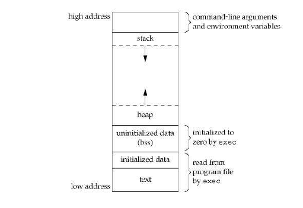

# 1.主函数

按照C++的标准中main必须是int类型；

c++ 中 类的成员函数(包括构造函数等)的参数列表有参数为指针类型时，若该成员变量为数组，则会编译错误。

c++的参数列表中有指针变量，指针赋值后该 被赋值变量的地址 就被写死了，无需担心因为参数列表中的临时变量销毁(弹栈)而消失。

当程序加载到内存中时，它被组织成不同的段。其中一个片段是**数据段**数据部分进一步细分为两部分：

**初始化数据段：**所有的全局、静态和常量数据都存储在这里。

**未初始化数据段(BSS)：**所有未初始化的数据都存储在此段中。

# 2.函数原型

2.1 [函数原型简介](./函数原型)

# 3.内联函数

3.1 [内联函数简介](./内联函数)

# 4.缺省参数

**既可以在类的声明中，也可以在函数定义中声明缺省参数，但不能既在类声明中又在函数定义中同时声明缺省参数。**

# 5.用const修饰的类成员

1. ==常对象只能调用它的常成员函数==

2. **常成员函数调用期间**，目的对象都被视为常对象。即调用期间不能修改对象的任何值，包括**不能调用没有用const修饰的成员函数**（常对象只能调用它的常成员函数）

==总结==：

1. ==普通对象==对于普通成员函数和const成员函数都可以调用。
2. const对象只能调用const类型的成员函数。
3. 普通函数可以调用其他的const成员函数
4. const成员函数不可调用普通成员函数。
5. ==const关键字可以用于对重载函数的区分==，（如果仅以const关键字为区分成员函数重载，又通过非const对象调用该函数时，编译器将选择不带const关键字的函数）。
6. [const用法总结](./const用法总结.md)

# 6.ostream

ostream 是个iostream库的类.

# 7.多态性

[多态性基本总结](./多态性.md)

# 8.重载、重写、隐藏与覆盖

[重载、重写、隐藏](./重载、重写、覆盖与隐藏.md)

# 9.返回类型为引用或非引用

[返回类型为引用或非引用](./返回类型为引用或非引用.md)

# 10.友元函数及友元类

[友元函数及友元类](./友元.md)

# 11.拷贝构造函数

[拷贝构造函数](./拷贝构造函数.md)

# 12.预处理

[预处理指令基本用法](./预处理.md)

# 13.前置声明及头文件重复包含

[前置声明与头文件](./前置声明与头文件.md)

# 14.常数据成员与静态数据成员的区别

[常数据成员与静态成员的区别](./常数据成员与静态成员的区别.md)

