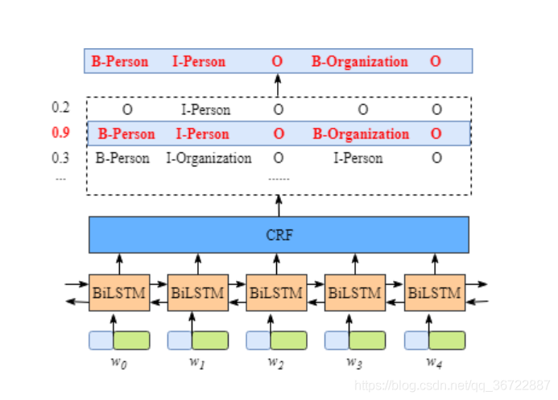
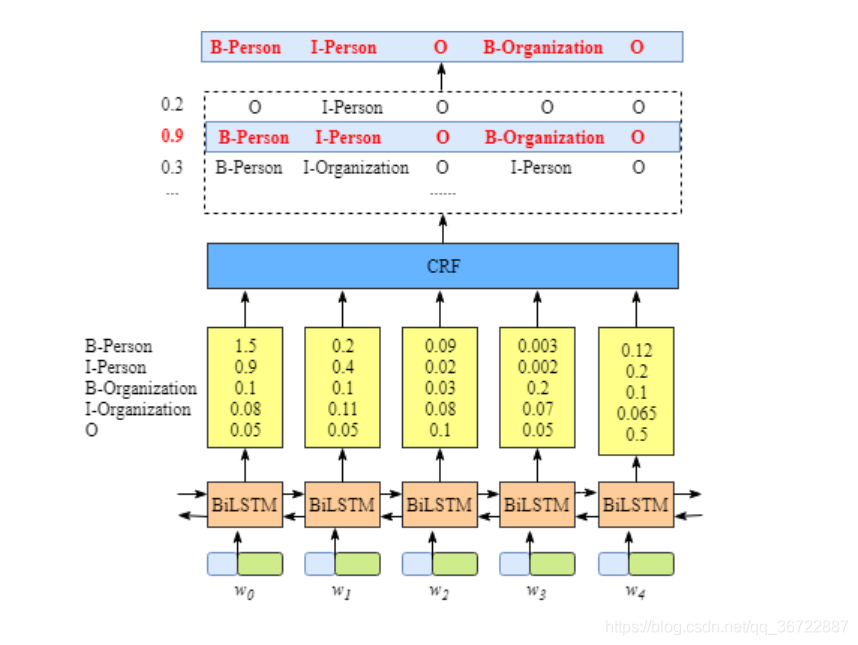
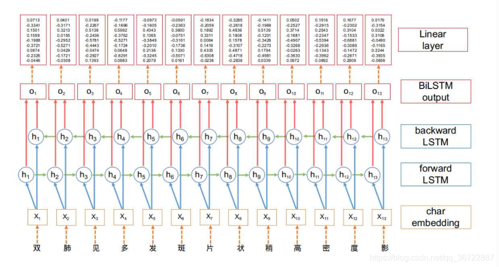
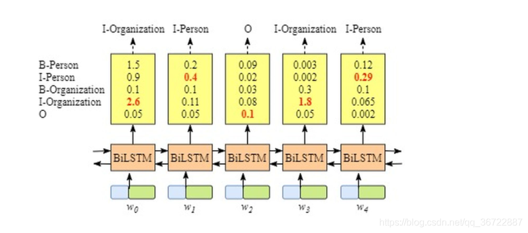
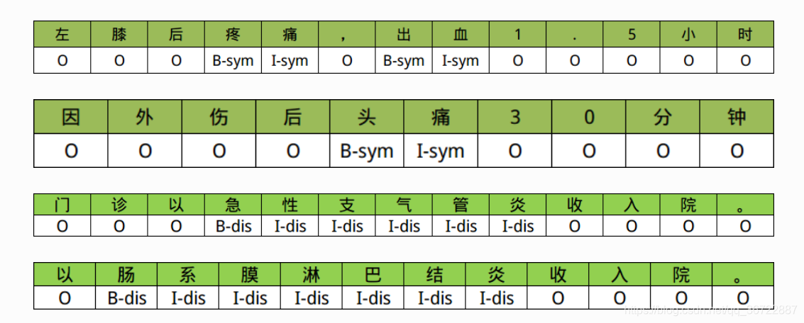
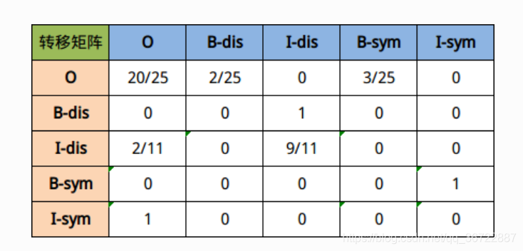
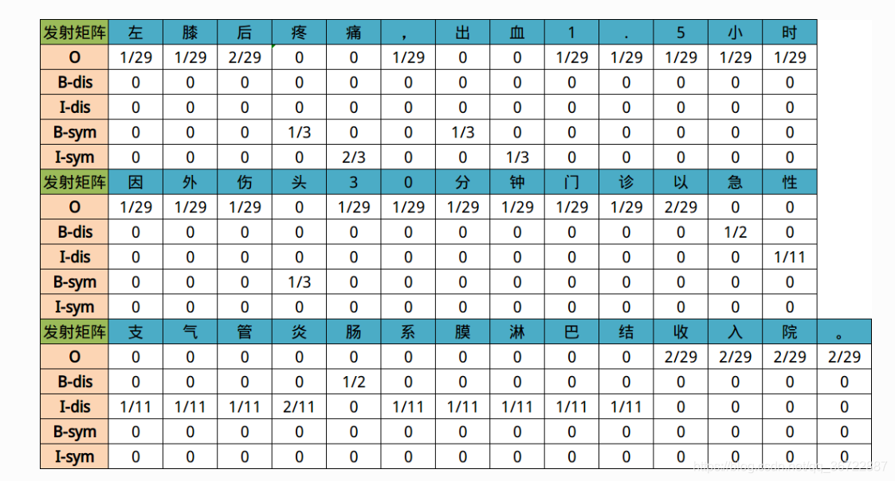
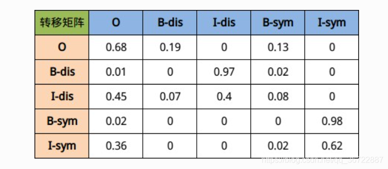

# 1 BiLSTM-CRF模型用途

## 1.1 命名实体识别(Named Entity Recognition，NER)

### 1.1.1 定义

​	从一段自然语言文本中找出相关实体，并标注出其位置以及类型。

​	是信息提取, 问答系统, 句法分析, 机器翻译等应用领域的重要基础工具。

​	在自然语言处理技术走向实用化的过程中占有重要地位. 包含行业, 领域专有名词, 如人名, 地名, 公司名, 机构名, 日期, 时间, 疾病名, 症状名, 手术名称, 软件名称等。

​	**命名实体识别**问题实际上是==序列标注问题==

### 1.1.2 序列标注问题

指的是模型的输入是一个序列, 包括文字, 时间等, 输出也是一个序列。

针对输入序列的每一个单元, 输出一个特定的标签。

以中文分词任务进行举例, 例如：

输入序列是一串文字: “我是中国人”, 

输出序列是一串标签: “OOBII”, 

其中"BIO"组成了一种中文分词的标签体系: B表示这个字是词的开始, I表示词的中间到结尾, O表示其他类型词.。

因此我们可以根据输出序列"OOBII"进行解码, 得到分词结果"我\是\中国人"。

序列标注问题涵盖了自然语言处理中的很多任务, 包括语音识别, 中文分词, 机器翻译, 命名实体识别等, 而常见的序列标注模型包括HMM, CRF, RNN, LSTM, GRU等模型。

其中在命名实体识别技术上, **目前主流的技术是通过BiLSTM+CRF模型进行序列标注**。

# 2 BiLSTM-CRF模型介绍

## 2.1 数据标签及模型架构

### 2.1.1 数据标签

```python
B-Person （人名的开始部分）

I- Person （人名的中间部分）

B-Organization （组织机构的开始部分）

I-Organization （组织机构的中间部分）

O （非实体信息）
```


### 2.1.2 模型架构

x 是包含了5个单词的一句话（W0,W1,W2,W3,W4）。还有，在句子x中[W0,W1]是人名，[W3]是组织机构名称，其他都是“O”。



​	句中的每个单词是一条包含[词嵌入](https://blog.csdn.net/weixin_46707326/article/details/120358125)和字嵌入的词向量，词嵌入通常是事先训练好的，字嵌入则是随机初始化的。所有的嵌入都会随着训练的迭代过程被调整。

​	BiLSTM-CRF的输入是词嵌入向量，输出是每个单词对应的预测标签。



​	BiLSTM层的输入表示该单词对应各个类别的分数。如W0，BiLSTM节点的输出是**1.5 (B-Person), 0.9 (I-Person), 0.1 (B-Organization), 0.08 (I-Organization) and 0.05 (O)**。这些分数将会是**CRF层的输入**。

​	所有的经BiLSTM层输出的分数将作为CRF层的输入，类别序列中分数最高的类别就是我们预测的最终结果。


## 2.2 BiLSTM模型

### 2.2.1 BiLSTM模型介绍及联系

​	所谓的BiLSTM，就是(Bidirectional LSTM)双向[LSTM](https://blog.csdn.net/qian99/article/details/88628383)。

​	 单向的LSTM模型只能捕捉到从前向后传递的信息, 而双向的网络可以同时捕捉正向信息和反向信息, 使得对文本信息的利用更全面, 效果也更好。
​	在BiLSTM网络最终的输出层后面增加了一个线性层, 用来将BiLSTM产生的隐藏层输出结果投射到具有某种表达标签特征意义的区间, 具体如下图所示：



### 2.2.2 代码实现细节

- BiLSTM网络结构
  - 设置隐藏层维度的时候, 需要将hidden_size // 2
  - 总共有3层需要构建, 分别是词嵌入层, 双向LSTM层, 全连接线性层
  - 在代码层面, 双向LSTM就是将nn.LSTM()中的参数bidirectional设置为True
  
- BiLSTM网络的代码实现
  
    - 构建类BiLSTM的初始化函数
    - 添加文本向量化的辅助函数, 注意padding填充为相同长度的Tensor
    - 要注意forward函数中不同张量的形状约定
    

## 2.3 CRF模型

### 2.3.1 CRF模型定义及联系

- CRF(全称Conditional Random Fields), 条件随机场. 是给定输入序列的条件下, 求解输出序列的条件概率分布模型.

- 即使没有CRF层，我们照样可以训练一个基于BiLSTM的命名实体识别模型（因为BiLSTM模型的结果是单词对应各类别的分数，我们可以选择分数最高的类别作为预测结果。）


- 例如W0，“B-Person”的分数最高（1.5），那么我们可以选定“B-Person”作为预测结果。同样的，W1是“I-Person”, W2是“O”,W3是 “B-Organization” ，W4是 “O”。


- 但实际情况可能出现下列预测结果




### 2.3.2 CRF作用

CRF层可以加入一些约束来保证最终预测结果是有效的（CRF层可以学习到句子的约束条件）。这些约束可以在训练数据时被CRF层自动学习得到。

可能的约束条件有：

- 句子的开头应该是“B-”或“O”，而不是“I-”。
- “B-label1 I-label2 I-label3…”，在该模式中，类别1,2,3应该是同一种实体类别。比如，“B-Person I-Person” 是正确的，而“B-Person I-Organization”则是错误的。
- “O I-label”是错误的，命名实体的开头应该是“B-”而不是“I-”。

有了这些有用的约束，错误的预测序列将会大大减少。

### 2.3.3 CRF层的损失函数

#### 1 Emission Score（发射分数/状态分数）

发射概率, 是指已知当前标签的情况下, 对应所出现字符的概率. 通俗理解就是当前标签比较可能出现的文字有哪些, 及其对应出现的概率.

| Label          | Index |
| -------------- | ----- |
| B-Person       | 0     |
| I-Person       | 1     |
| B-Organization | 2     |
| I-Organization | 3     |
| O              | 4     |

Xi,yj代表状态分数，i是单词的位置索引，yj是类别的索引。根据上表，

$$
x_i = 1, y_j = x_{w_1}, B - Organization = 0.1
$$
表示单词W1被预测为B−Organization的分数是0.1。









#### 2 Transition Score （转移分数）

我们用 t (y~i~，y~j~) 来表示转移分数。例如，t(B−Person,I−Person)=0.9 表示从类别 B−Person → I−Person的分数是0.9。因此，我们有一个所有类别间的**转移分数矩阵**。

为了使转移分数矩阵更具鲁棒性，我们加上START 和 END两类标签。START代表一个句子的开始（不是句子的第一个单词），END代表一个句子的结束。

下表是加上START和END标签的转移分数矩阵。

| Label          | Index |
| -------------- | ----- |
| B-Person       | 0     |
| I-Person       | 1     |
| B-Organization | 2     |
| I-Organization | 3     |
| O              | 4     |
| START          | 5     |
| END            | 6     |

如上表格所示，转移矩阵已经学习到一些有用的约束条件：

- 句子的第一个单词应该是“B-” 或 “O”，而不是“I”。（从“START”->“I-Person 或 I-Organization”的转移分数很低）
- “B-label1 I-label2 I-label3…”，在该模式中，类别1,2,3应该是同一种实体类别。比如，“B-Person I-Person” 是正确的，而“B-Person I-Organization”则是错误的。（“B-Organization” -> “I-Person”的分数很低）
- “O I-label”是错误的，命名实体的开头应该是“B-”而不是“I-”。
- 


要怎样得到这个转移矩阵呢？

实际上，转移矩阵是BiLSTM-CRF模型的一个参数。在训练模型之前，你可以随机初始化转移矩阵的分数。

这些分数将随着训练的迭代过程被更新，换句话说，CRF层可以自己学到这些约束条件。


#### 3 CRF损失函数

CRF损失函数由两部分组成，真实路径的分数 和 所有路径的总分数。真实路径的分数应该是所有路径中分数最高的。

例如，我们的数据集中有如下几种类别：

| Label          | Index |
| -------------- | ----- |
| B-Person       | 0     |
| I-Person       | 1     |
| B-Organization | 2     |
| I-Organization | 3     |
| O              | 4     |
| START          | 5     |
| END            | 6     |

一个包含5个单词的句子，可能的类别序列如下：

- \1. START B-Person B-Person B-Person B-Person B-Person END
- \2. START B-Person I-Person B-Person B-Person B-Person END
- ……
- **10. START B-Person I-Person O B-Organization O END**
- N. O O O O O O O

每种可能的路径的分数为Pi，共有N条路径，则路径的总分是

$$
P_total = P_1 + P_2 + ... + P_N = e^{S_1} + e^{S_2} + ... + e^{S_N}
$$
其中e是常数e。

如果第十条路径是真实路径，也就是说第十条是正确预测结果，那么第十条路径的分数应该是所有可能路径里得分最高的。

根据如下损失函数，在训练过程中，BiLSTM-CRF模型的参数值将随着训练过程的迭代不断更新，使得真实路径所占的比值越来越大。
$$
LossFunction = \frac{P_{RealPath}}{P_1 + P_2 + ... + P_N}
$$


## 2.4 BiLSTM-CRF模型代码实现

### 2.4.1 BiLSTM+CRF模型的实现

1. 导入工具包并完成辅助函数
2. 文本信息张量化
3. 创建类的初始化函数
4. 创建获取发射矩阵张量的函数
5. 计算前向传播分值的函数
6. 计算句子真实分值的函数
7. 维特比算法的实现
8. 完善BiLSTM_CRF类的全部功能

### 2.4.2 模型训练的流程

1. 熟悉字符到数字编码的码表
2. 熟悉训练数据集的样式和含义解释
3. 完成字符到id的映射函数
4. 获取训练数据和验证数据的函数
5. 完成准确率和召回率的评估代码
6. 绘制损失曲线和评估曲线图
7. 完成训练模型的完整代码
8. 训练集和验证集损失曲线和指标数据曲线的分析