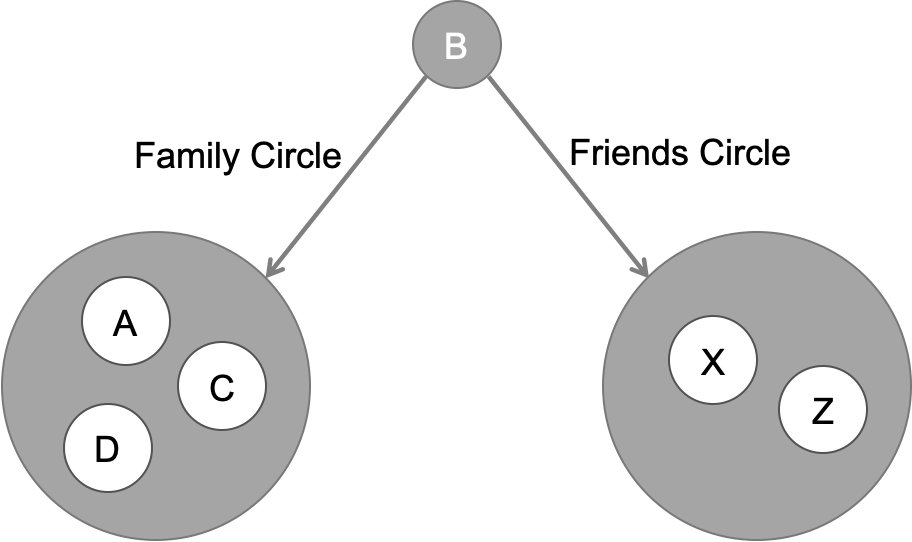
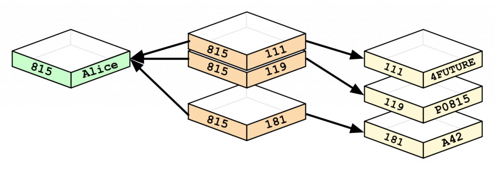
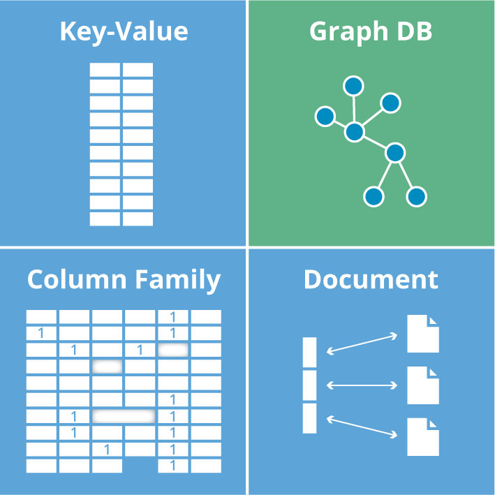
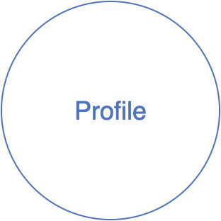
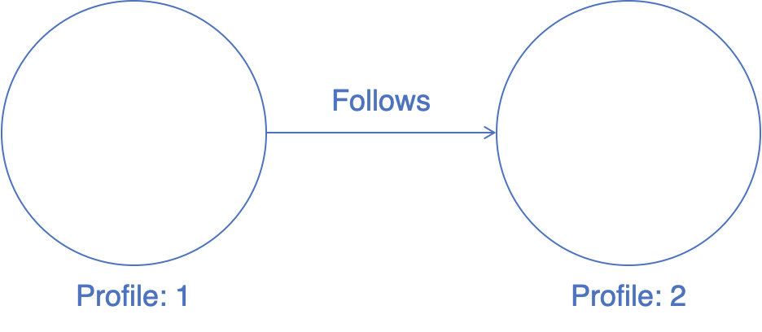
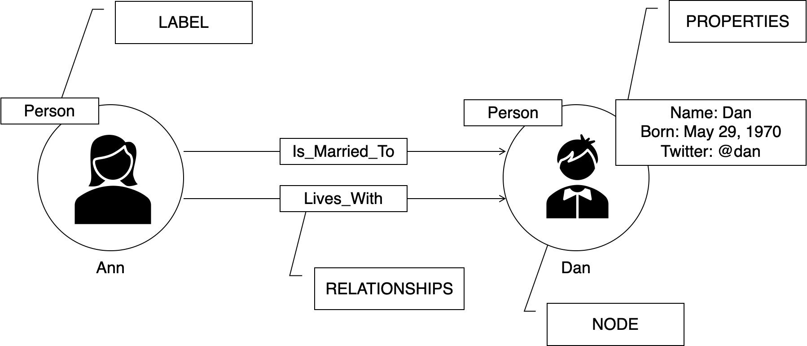
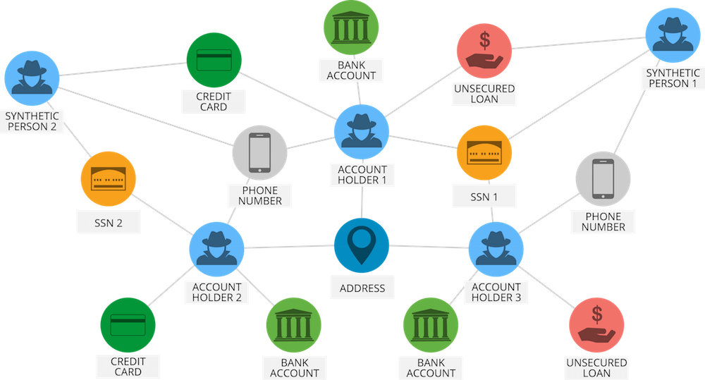
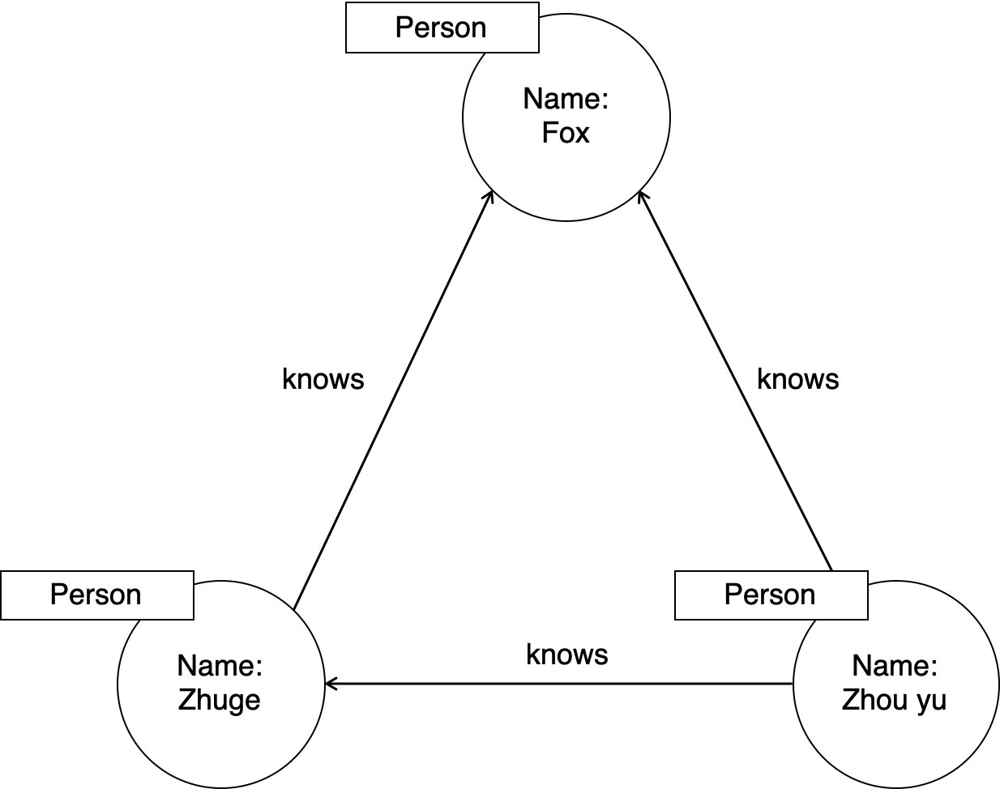

##  图数据库Neo4j介绍

### 1.1 什么是图数据库（Graph Database）

随着社交、电商、金融、零售、物联网等行业的快速发展，现实社会织起了了一张庞大而复杂的关系网，传统数据库很难处理关系运算。大数据行业需要处理的数据之间的关系随数据量呈几何级数增长，急需一种支持海量复杂数据关系运算的数据库,图数据库应运而生。

世界上很多著名的公司都在使用图数据库，比如：

- 社交领域：Facebook、Twitter、Linkedin用它来管理社交关系，实现好友推荐
- 零售领域：eBay、沃尔玛使用它实现商品实时推荐，给买家更好的购物体验
- 金融领域：摩根大通、花旗和瑞银等银行在用图数据库做风控处理
- 汽车制造领域：沃尔沃、戴姆勒和丰田等顶级汽车制造商依靠图数据库推动创新制造解决方案
- 电信领域：Verizon、Orange和AT&T等电信公司依靠图数据库来管理网络,控制访问并支持客户360
- 酒店领域：万豪和雅高酒店等顶级酒店公司依使用图数据库来管理复杂且快速变化的库存

图数据库并非指存储图片的数据库，而是以图数据结构存储和查询数据。

图数据库是基于图论实现的一种NoSQL数据库，其数据存储结构和数据查询方式都是以图论为基础的，图数据库主要用于存储更多的
车接数据。

> 图论[Graph Theory]是数学的一个分支。 它以图为研究对象图论中的图是由若干给定的点及连接两点的线所构成的图形，这种图
> 形通常用来描述某些事物之间的某种特定关系，用点代表事物，用连接两点的线表示相应两个事物间具有这种关系。


在上图中，轮廓"A"具有圆圈以连接到其他轮廓:家庭圈(B, C, D)和朋友圈(B, C)。

再次，如果我们打开配置文件"B"，我们可以观察以下连接的数据。



像这样，这些应用程序包含大量的结构化，半结构化和非结构化的连接数据。在RDBMS数据库中表示这种非结构化连接数据并不容
易。如果我们在RDBMS数据库中存储这种更多连接的数据，那么检索或遍历是非常困难和缓慢的。所以要表示或存储这种更连接的数
据，我们应该选择一个流行的图数据库。

图数据库非常容易地存储这种更多连接的数据。它将每 个配置文件数据作为结点存储在内部，它与相邻结点连接的结点，它们通过关
系相互连接。他们存储这种连接的数据与上面的图表中的相同，这样检索或遍历是非常容易和更快的。
关系查询性能对比

在数据关系中心，图形数据库在查询速度方面非常高效，即使对于深度和复杂的查询也是如此。在关系型数据库和图数据库(Neo4j)之间
进行了实验:在一个社交网络里找到最大深度为5的朋友的朋友，他们的数据集包括100万人，每人约有50个朋友。

**实验结果如下：**

| 深度 | MySQL执行时间(s) | Neo4J执行时间(s) | 返回记录数 |
| ---- | ---------------- | ---------------- | ---------- |
| 2    | 0.016            | 0.01             | ~2500      |
| 3    | 30.267           | 0.168            | ~110,000   |
| 4    | 1,543.505        | 1.359            | -600,000   |
| 5    | 未完成           | 2.132            | -800,000   |

#### 对比关系型数据库

| 关系型数据库(RDBMS) | 图数据库   |
| ------------------- | ---------- |
| 表                  | 图         |
| 行                  | 节点       |
| 列和数据            | 属性和数据 |
| 约束                | 关系       |

在关系型数据库中，Person和Department之间用外键表示关系：



在图数据库中，结点和关系取代表，外键和join：


在图数据库中，无论何时运行类似JOIN的操作， 数据库都会使用此列表并直接访问连接的结点，无需进行昂贵的搜索和匹配计算。

#### 对比其他NoSQL数据库

NoSQL数据库大致可以分为四类：

- 键值（key/value）数据库
- 列存储数据库
- 文档型数据库
- 图数据库



| 分类         | 数据模型           | 优势                                                 | 劣势                                           | 举例              |
| ------------ | ------------------ | ---------------------------------------------------- | ---------------------------------------------- | ----------------- |
| 键值数据库   | 哈希表             | 查找速度快                                           | 数据无结构化，通常只被当作字符串或者二进制数据 | Redis             |
| 列存储数据库 | 列式数据存储       | 查找速度快；支持分布横向扩展；数据压缩率高           | 功能相对受限                                   | HBase             |
| 文档型数据库 | 键值对扩展         | 数据结构要求不严格；表结构可变；不需要预先定义表结构 | 查询性能不高，缺乏统一的查询语法               | MongoDB           |
| 图数据库     | 节点和关系组成的图 | 利用图结构相关算法（最短路径、节点度关系查找等）     | 可能需要对整个图做计算，不利于图数据分布存储   | Neo4j、JanusGraph |

### 1.2 什么是Neo4j

[Neo4j](https://neo4j.com/)是一个开源的NoSQL图形数据库，2003年开始开发,使用scala和java语言，2007年开始发布。

- 是世界上最先进的图数据库之一 ，提供原生的图数据存储，检索和处理
- 采用属性图模型（Property graph model），极大的完善和丰富图数据模型
- 专属查询语言Cypher，直观、高效

Neo4j的特性：

- SQL就像简单的查询语言Neo4j CQL
- 它遵循属性图数据模型
- 它通过使用Apache Lucence支持索引
- 它支持UNIQUE约束
- 它包含一个用于执行CQL命令的UI：Neo4j数据浏览器
- 它支持完整的ACID（原子性，一致性，隔离性和持久性）规则
- 它采用原生图形库与本地GPE（图形处理引擎）
- 它支持查询的数据导出到SON和XLS格式
- 它提供了REST API,可以被任何编程语言（如ava, Spring, Scala等）访问
- 它提供了可以通过任何UI MVC框架（如Node JS）访问的Java脚本
- 它支持两种ava API：Cypher API和Native Java API来开发Java应用程序

Neo4j的优点：

- 它很容易表示连接的数据
- 检索/遍历/导航更多的连接数据是非常容易和快速的
- 它非常容易地表示半结构化数据
- Neo4j CQL查询语言命令是人性化的可读格式，非常容易学习
- 使用简单而强大的数据模型
- 它不需要复杂的连接来检索连接的/相关的数据，因为它很容易检索它的相邻结点或关系细节没有连接或索引

### 1.3 Neo4j数据模型

#### 图论基础

最简单的可能图是单个结点：



我们可以使用结点表示社交网络（如Google+个人资料）， 它不包含任何属性。向Google+个人资料添加一些属性：


在两个结点之间创建关系:



此处在两个Profile之间创建关系名称"关注”。这意味着Profile 1关注了Profile 2。

#### 属性图模型

Neo4j图数据库遵循属性图模型来存储和管理其数据。

属性图模型规则

- 表示结点，关系和属性中的数据.
- 结点和关系都包含属性
- 关系连接结点
- 属性是键值对
- 结点用圆圈表示，关系用方向键表示。
- 关系具有方向：单向和双向。
- 每个关系包含”开始结点”或”从结点"和”到结点"或”结束结点”

在属性图数据模型中，关系应该是定向的。如果我们尝试创建没有方向的关系，那么它将抛出一个错误消息。在Neo4j中， 关系也应
该是有方向性的。如果我们尝试创建没有方向的关系,那么Neo4j会抛出一个错误消息，"关系应该是方向性的”。

Neo4j图数据库将其所有数据存储在结点和关系中，我们不需要任何额外的RDBMS数据库或NoSQL数据库来存储Neo4j数据库数据,
它以图的形式存储数据。Neo4j使用本机GPE (图形处理引擎)来使用它的本机图存储格式。

图数据库数据模型的主要构建块是：

- 结点
- 关系
- 属性

简单的属性图的例子：


这里我们使用圆圈表示结点。使用箭头表示关系， 关系是有方向性的。我们可以用Properties (键值对)来表示Node的数据。在这个例
子中，我们在Node的Circle中表示了每个Node的Id属性。

### 1.4 Neo4j的构建元素

Neo4j图数据库主要有以下构建元素：

- 结点（相当于关系型数据库的一行数据Rows）
- 属性（相当于关系型数据库的列数据Columns或者属性attributes）
- 关系（相当于关系型数据库的Constraints，即多对多的关系表）
- 标签（相当于关系型数据库的表Table）
- 数据浏览器



#### 结点

结点(Node)是图数据库中的一个基本元素，来表示一个实体记录， 就像关系数据库中的一条记录-样。在Neo4j中结点可以包含多个
属性(Property)和多个标签(Label)。

- 结点是主要的数据元素
- 结点通过关系连接到其他结点
- 结点可以具有一个或多个属性(即，存储为键/值对的属性)
- 结点有一个或多个标签,用于描述其在图表中的作用

#### 属性

属性(Property)是用于描述图结点和关系的**键值对**。其中Key是一个字符串， 值可以通过使用任何Neo4j数据类型来表示

- 属性是命名值，其中名称(或键)是字符串
- 属性可以被索引和约束
- 可以从多个属性创建复合索引

#### 关系

关系(Relationship) 同样是图数据库的基本元素。当数据库中已经存在结点后，需要将结点连接起来构成图。关系也称为图论的边(Edge) ，其始端和末端都必须是结点，关系不能指向空也不能从空发起。

关系和结点一样可以包含多个属性，但关系只能有一个类型(Type)。

- 关系连接两个结点
- 关系是方向性的
- 结点可以有多个甚至递归的关系
- 关系可以有一个或多个属性(即存储为键/值对的属性)

基于方向性，Neo4j关系被分为两种主要类型:

- 单向关系
- 双向关系

#### 标签

标签(Label)将一个公共名称与一组结点或关系相关联，**结点或关系可以包含一个或多个标签**。我们可以为现有结点或关系创建新标签，我们可以从现有结点或关系中删除标签。

- 标签用于将结点分组
- 一个结点可以具有多个标签
- 对标签进行索引以加速在图中查找结点
- 本机标签索引针对速度进行了优化

#### Neo4j Browser

一旦我们安装Neo4j， 我们就可以访问Neo4j数据浏览器

### 1.5 使用场景

欺诈检测



实时推荐引擎


知识图谱


……

## 2 环境搭建

### 2.1 安装Neo4j Community Server

**下载地址：**https://neo4j.com/download-center/

**安装方式：**

- Neo4j Enterprise Server
- Neo4j Community Server

解压：

```bash
$ tar -zxvf neo4j-community-4.4.3-unix.tar.gz 
```

启动：

```bash
$ cd neo4j-community-4.4.3/bin/
$ ./neo4j start
Directories in use:
home:         /root/neo4j-community-4.4.3
config:       /root/neo4j-community-4.4.3/conf
logs:         /root/neo4j-community-4.4.3/logs
plugins:      /root/neo4j-community-4.4.3/plugins
import:       /root/neo4j-community-4.4.3/import
data:         /root/neo4j-community-4.4.3/data
certificates: /root/neo4j-community-4.4.3/certificates
licenses:     /root/neo4j-community-4.4.3/licenses
run:          /root/neo4j-community-4.4.3/run
Starting Neo4j.
Started neo4j (pid:134371). It is available at http://localhost:7474
There may be a short delay until the server is ready.
```


### 2.2 neo4j切换数据库

1. 关闭neo4j
2. 在neo4j的安装文件下找到conf文件夹，打开里面的neo4j.conf

    ```bash
    #dbms.default_database=neo4j
    #注释掉上面一行
    #后面将neo4j改为自己想要的数据库名
    dbms.default_database=test
    ```
同时
    ```bash
    dbms.allow_upgrade=true
    #去掉前面的#注释符，允许更新
    ```


3. 启动neo4j，选择想要的数据库即可


## 3 Neo4j - CQL使用

### 3.1 Neo4j - CQL简介

Neo4j的Cypher语言是为处理图形数据而构建的，CQL代表Cypher查询语言。 像Oracle数据库具有查询语言SQL， Neo4j具有CQL作为查询语言。

- 它是Neo4j图形数据库的查询语言
- 它是一种声明性模式匹配语言
- 它遵循SQL语法。
- 它的语法是非常简单且人性化、可读的格式

| CQL命令  | 用法                         |
| -------- | ---------------------------- |
| CREATE   | 创建节点，关系和属性         |
| MATCH    | 检索有关节点，关系和属性数据 |
| RETURN   | 返回查询结果                 |
| WHERE    | 提供条件过滤检索数据         |
| DELETE   | 删除节点和关系               |
| REMOVE   | 删除节点和关系的属性         |
| ORDER BY | 排序检索数据                 |
| SET      | 添加或更新标签               |

三个共同朋友的社交图：



使用Cypher语言来描述关系

```cypher
(fox)<-[:knows]-(Zhou Yu)-[:knows]->(Zhuge)-[:knows]->(fox)
```

### 3.2 常用命令

文档地址：https://neo4j.com/docs/cypher-manual/current/introduction/


#### LOAD载入CSV文件

##### 1、找到安装时设置的数据库所在位置的import文件夹

我的是：D:\Environment\neo4j-chs-community-4.2.2-windows\import

##### 2、从import里面的内容名开始写即可

比如：在import路径下再创建**neo4jResource**目录，将要导入的**csv**文件放到里面：

在Sell窗口中发送命令：

**对于含有列名的数据：**

```CQL
LOAD CSV WITH HEADERS FROM "file:///neo4jResource/star_nodes_utf8.csv" AS line
create (:star {name:line.name, id:line.id})
```

**对于没有列名的数据：**

```CQL
LOAD CSV WITH HEADERS FROM "file:///neo4jResource/star_nodes_utf8.csv" AS line
create (:star {name:line[0], id:line[1]})
```

**注意：.csv文件要用“记事本”打开，然后点击"另存为"，将格式改成"UTF-8"再进行导入。**


**载入关系图谱**

```CQL
LOAD CSV WITH HEADERS FROM "file:///neo4jResource/star_relations_utf8.csv" AS line
create (:starRelation {subject:line.subject, from_id:line.from_id, relation:line.relation, object:line.object, to_id:line.to_id})


match (subject:`star`),(relation:`starRelation`),(object:`star`) 
where subject.id = relation.from_id and relation.to_id = object.id
create (subject)-[:明星关系{star_relation:relation.relation}]->(object)
```


#### CREATE创建

create语句是创建模型语句用来创建数据模型

**创建结点**

```cypher
// 创建简单结点
CREATE (n)
// 创建多个结点
CREATE (n), (m)
```

创建一个带标签和属性的结点并返回该结点

```cypher
CREATE (n:Person{
    name: "Sean Lau Ching-wan", born: 1964})
RETURN n
<id>: 171
born: 1964
name: Sean Lau Ching-wan
```

**创建关系**

Neo4j图数据库遵循属性图模型来存储和管理其数据。

根据属性图模型，关系应该是**定向**的。否则， Neo4j将抛出一个错误消息。

基于方向性，Ne04j关系被分为两种主要类型。

- 单向关系
- 双向关系

**使用新结点创建关系**

```cypher
CREATE (n:Person {
    name: 'Yau Nai-hoi', born: 1968})-[r:FOLLOWS]->(m:Person{
    name: 'Johnnie To Kei-fung', born:1955})
RETURN type(r)
```

|      | type(r)   |
| ---- | --------- |
| 1    | "FOLLOWS" |

**使用已知结点创建带属性的关系**

```cypher
MATCH (n:Person{
    name: "Patrick Yau Tat-Chi"}),(m:Person{
    name: "Johnnie To Kei-fung"})
CREATE (n)-[r:FOLLOWS]->(m)
```

#### MATCH查询

Neo4j CQL RETURN子句用于

- 检索结点的某些属性
- 检索结点的所有属性
- 检索结点和关联关系的某此属性
- 检索结点和关联关系的所有属性

```cypher
MATCH (n:Movie {
    title: 'The Green Mile'})
RETURN n
<id>: 130
released: 1999
tagline: Walk a mile you'll never forget.
title: The Green Mile
```

#### WHERE子句

像SQL-样，Neo4j CQL在CQL MATCH命令中提供了WHERE子句来过滤MATCH查询的结果。

```cypher
MATCH (n:Movie)
WHERE n.title = "The Green Mile"
RETURN n
```

#### DELETE删除

Neo4j使用CQL DELETE子句

- 删除结点
- 删除结点及相关结点和关系。

**删除关系**

```cypher
MATCH (n:Person{
    name: "Johnnie To Kei-fung"})<-[r]-(m)
DELETE r
RETURN type(r)
```

**删除结点（前提：结点不存在关系）**

```cypher
MATCH (n:Person{
    name: "Patrick Yau Tat-Chi"})
DELETE n
```

#### REMOVE删除

有时基于客户端要求，我们需要向现有结点或关系添加或删除属性。我们使用Neo4j CQL REMOVE子句来删除结点或关系的现有属性。

- 删除结点或关系的标签
- 删除结点或关系的属性

**移除属性**

```cypher
MATCH (n:Person{
    name: "Johnnie To Kei-fung"}) REMOVE n.born
RETURN n
<id>: 173
name: Johnnie To Kei-fung
```

**移除标签**

新增一个结点，有多个标签

```cypher
CREATE (n:Person:Director{
    born: 1958, name: "Tony Leung Ka-fai"})
```

删除一个标签

```cypher
MATCH (n:Person:Director{
    born: 1958, name: "Tony Leung Ka-fai"})
REMOVE n:Director
RETURN n;
```

#### SET子句

有时，根据我们的客户端要求，我们需要向现有结点或关系添加新属性。要做到这一点Neo4j CQL提供了一个SET子句。

- 向现有结点或关系添加新属性
- 添加或更新属性值

```cypher
MATCH (n:Person{
    name: "Johnnie To Kei-fung"}) SET n.born = 1955
RETURN n
```

#### ORDER BY排序

Neo4j CQL在MATCH命令中提供了"ORDER BY"子句，对MATCH查询返回的结果进行排序。

我们可以按升序或降序对行进行排序。默认情况下，它按升序对行进行排序。如果我们要按降序对它们进行排序， 我们需要使用DESC子
句

```cypher
MATCH (n:Person)
RETURN n ORDER BY n.name DESC
LIMIT 5
```

| "n"                                  |
| ------------------------------------ |
| {"born":1954,"name":"Zach Grenier"}  |
| {"born":1968,"name":"Yau Nai-hoi"}   |
| {"born":1972,"name":"Wil Wheaton"}   |
| {"born":1942,"name":"Werner Herzog"} |
| {"born":1956,"name":"Vincent Ward"}  |

#### LIMIT和SKIP子句

Neo4j CQLE提供LIMIT子句和SKIP来过滤或限制查询返回的行数。

LIMIT返回前几行，SKIP忽略前几行。

**前2行**

```cypher
MATCH (n)
RETURN n
LIMIT 2
```

**忽略前2行**

```cypher
MATCH (n)
RETURN n SKIP 2
```

#### NULL值

Neo4j CQL将空值视为对结点或关系的属性的缺失值或未定义值。

当我们创建一个具有现有结点标签名称但未指定其属性值的结点时，它将创建一个具有NUL属性值的新结点。

```cypher
MATCH (n:Person)
WHERE n.name IS NULL
RETURN n
```

#### IN操作符

与5QL一样，Neo4j CQL提供了一个IN运算符。 以便为CQL命令提供值的集合。

```cypher
MATCH (n:Person)
WHERE n.name IN ["Carrie-Anne Moss", "Lilly Wachowski"]
RETURN n;
```

#### INDEX索引

Neo4j SQL支持芍点或美系属性上的索引以提高应用程序的性能。

我们可以为具有相同标签名称的所有结点的属性创建索引。

我们可以在MATCH或WHERE或IN运算符上使用这些索引列来改进CQL Command的执行。

**Neo4J索引操作**

- Create Index创建索引
- Drop Index丢弃索引

**增加索引**

```cypher
CREATE INDEX FOR (n:Person) ON (n.name)
```

#### UNIQUE约束

在Neo4]数据库中，CQL CREATE命令始终创建新的结点或关系，这意味着即使您使用相同的值，它也会插入一个新行。根据我们对某些
结点或关系的应用需求，我们必须避免这种重复。

像SQL-样，Neo4j数据库也支持对NODE或Relationship的属性的UNIQUE约束

**UNIQUE约束的优点**

- 避免重复记录
- 强制执行数据完整性规则

```cypher
CREATE CONSTRAINT ON (n:Person) ASSERT n.name IS UNIQUE
DROP CONSTRAINT ON (n:Person) ASSERT n.name IS UNIQUE
```

#### DISTINCT

这个函数的用法就像SQL中的distinct关键字，返回的是所有不同值。

```cypher
MATCH (n:Person)
RETURN DISTINCT (n.name)
```

### 3.3 常用函数

#### 

| 函数             | 用法                                           |
| ---------------- | ---------------------------------------------- |
| String字符串     | 它们用于使用String字面量                       |
| Aggregation聚合  | 它们用于对CQL查询结果执行一些聚合操作          |
| Relationship关系 | 他们用于获取关系的细节，如startnode, endnode等 |

#### 字符串函数

#### 

与SQL一样。Neo4J CQL提供了一组String函数，用于在CQL查询中获取所需的结果。

| 功能      | 描述                           |
| --------- | ------------------------------ |
| UPPER     | 它用于将所有字母更改为大写字母 |
| LOWER     | 它用于将所有字母改为小写字母   |
| SUBSTRING | 它用于获取给定String的子字符串 |
| REPLACE   | 它用于替换一个字符串的子字符串 |

```cypher
MATCH (e)
RETURN id(e), e.name, substring(e.name, 0, 2)
```

#### AGGREGATION聚合

和SQL-样。Neo4j CQL提供了一-些在RETURN子句中使用的聚合函数。它类似于 SQL中的GROUP BY子句。

我们可以使用MATCH命令中的RETURN +聚合函数来处理一组结点并返回一些聚合值。

| 聚集功能 | 描述                                  |
| -------- | ------------------------------------- |
| COUNT    | 它返回由MATCH命令返回的行数           |
| MAX      | 它从MATCH命令返回的一组行返回最大值   |
| MIN      | 它返回由MATCH命令返回的一组行的最小值 |
| SUM      | 它返回由MATCH命令返回的所有行的求和值 |
| AVG      | 它返回由MATCH命令返回的所有行的平均值 |

```cypher
MATCH (e)
RETURN count(e)
```

#### 关系函数

关系函数I
Neo4j CQL提供了一组关系函数，以在获取开始结点,结束结点等细书时知道关系的细节。

| 功能      | 描述                                   |
| --------- | -------------------------------------- |
| STARTNODE | 它用于知道关系的开始节点               |
| ENDNODE   | 它用于知道关系的结束节点               |
| ID        | 它用于知道关系的ID                     |
| TYPE      | 它用于知道字符串表示中的一个关系的TYPE |

```cypher
MATCH (a)-[r] ->(b)
RETURN id(r), type(r)
```

### 3.4 neo4j-admin使用

#### 数据库备份

对Neo4j数据进行备份、还原、迁移的操作时，要关闭neo4j

```bash
$ ./neo4j-admin dump --database=graph.db --to=/root/graph_backup.dump
```

#### 数据库恢复

还原、迁移之前，要关闭neo4j服务。

```bash
$ ./neo4j-admin load --from=/root/graph_backup.dump --database=graph.db 
```

## 4 Spring Boot整合Neo4j

### 4.1 spring-data-neo4j

版本：Spring Boot 2.3.12.RELEASE、Spring Data Neo4j 5.3.9.RELEASE

文档地址：https://docs.spring.io/spring-data/neo4j/docs/current/reference/html/#reference

#### 添加Neo4j依赖

```xml
<dependency>
    <groupId>org.springframework.boot</groupId>
    <artifactId>spring-boot-starter-data-neo4j</artifactId>
</dependency>
```

#### 添加配置

注意：不同版本依赖配置可能不一样，可通过neo4j自动配置类查看

```properties
# neo4j配置
spring.data.neo4j.uri=neo4j://localhost:7687
spring.data.neo4j.username=neo4j
spring.data.neo4j.password=12345678
```

#### 创建实体

`@NodeEntity`：标明是一个结点实体
`@RelationshipEntity`：标明是一个关系实体
`@ld`：实体主键
`@Property`：实体属性
`@GeneratedValue`：实体属性值自增
`@StartNode`：开始结点（可以理解为父结点）
`@EndNode`：结束结点（可以理解为子结点）

```java
package com.tuling.neo4jspringboot.entity;

import lombok.AllArgsConstructor;
import lombok.Data;
import lombok.NoArgsConstructor;
import org.neo4j.ogm.annotation.GeneratedValue;
import org.neo4j.ogm.annotation.Id;
import org.neo4j.ogm.annotation.NodeEntity;
import org.neo4j.ogm.annotation.Property;

@Data
@NoArgsConstructor
@AllArgsConstructor
@NodeEntity("Person")
public class Person {
    /**
     * id
     */
    @Id
    @GeneratedValue
    private Long id;

    /**
     * 名字
     */
    @Property
    private String name;

    /**
     * 出生年份
     */
    @Property
    private Long born;
}
package com.tuling.neo4jspringboot.entity;

import lombok.AllArgsConstructor;
import lombok.Data;
import lombok.NoArgsConstructor;
import org.neo4j.ogm.annotation.*;

@Data
@NoArgsConstructor
@AllArgsConstructor
@RelationshipEntity("COUPLE")
public class PersonRelationship {
    /**
     * id
     */
    @Id
    @GeneratedValue
    private Long id;

    /**
     * 开始结点
     */
    @StartNode
    private Person start;

    /**
     * 结束结点
     */
    @EndNode
    private Person end;
}
```

#### 创建接口继承Neo4jRepository

```java
package com.tuling.neo4jspringboot.dao;

import com.tuling.neo4jspringboot.entity.Person;
import org.springframework.data.neo4j.repository.Neo4jRepository;
import org.springframework.stereotype.Repository;

@Repository
public interface PersonRepository extends Neo4jRepository<Person, Long> {
}
package com.tuling.neo4jspringboot.dao;

import com.tuling.neo4jspringboot.entity.PersonRelationship;
import org.springframework.data.neo4j.repository.Neo4jRepository;

public interface PersonRelationshipRepository extends Neo4jRepository<PersonRelationship, Long> {
}
```