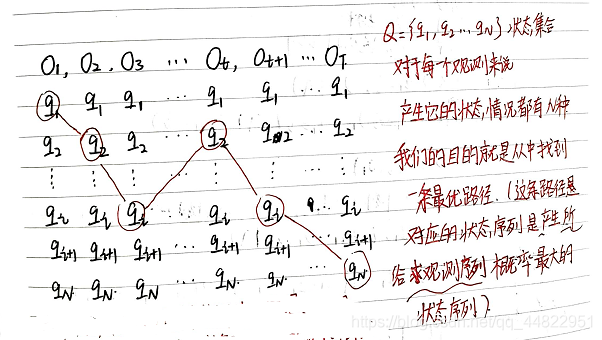
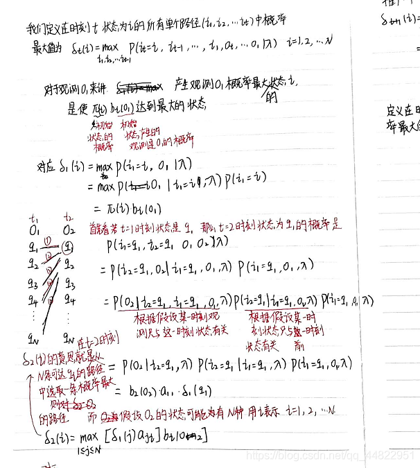
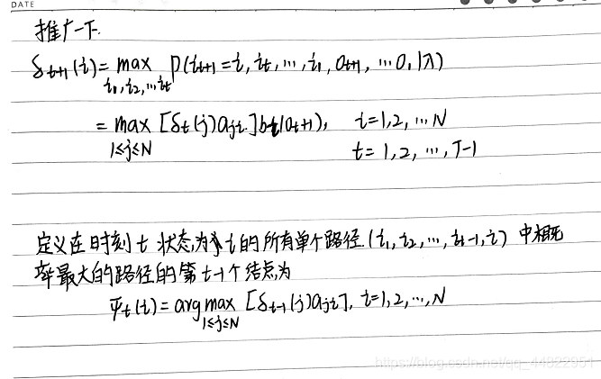
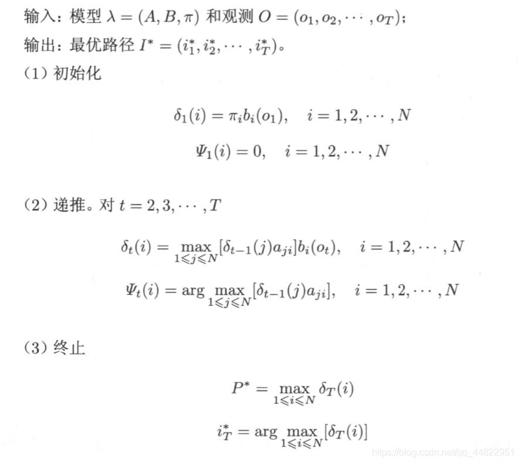
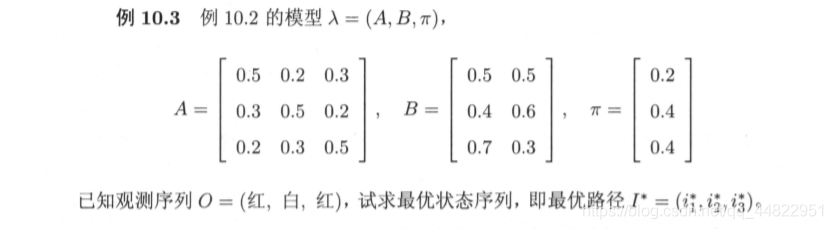

隐马尔可夫模型是一种有向图模型，由一个隐藏的马尔可夫链随机生成隐藏的状态随机序列（每个字对应的标注），再由各个状态生成一个可观察的状态随机序列（由字组成的序列）。

隐马尔可夫模型由初始状态概率矩阵、状态转移概率矩阵和观测概率矩阵三要素组成。

- 初始状态概率矩阵：将每一个标注作为句子第一个字的标注概率组成初始状态概率矩阵。
- 状态转移概率矩阵：由某一个标注转移到下一个标注的概率构成状态转移概率矩阵。
- 观测概率矩阵：在某个标注下，由生成某个词的概率构成观测概率矩阵。

在训练过程中，通过最大似然估计方法估计模型三要素。对于给定的预测数据，输出每个字对应的标注。

隐马尔可夫模型的训练和识别速度较快，但由于模型认定观测到句子中的每个字都相互独立，因此模型预测效果相对较差。


# 隐马尔可夫模型的预测问题

隐马尔可夫模型的预测问题，也称为解码问题。

已知模型 λ = (A， B， π ) 和观测序列O=(o~1~ ,o~2~,…o~T~),求对给定观测序列条件概率P(I |O) 最大的状态序列I=(i~1~, i~2~, … i~T~). 即给定观测序列，求最有可能的对应的状态序列。

我们用的方法是维特比算法，下面介绍一下维特比算法。

维特比算法是一个基于动态规划思想的方法，它把求解状态序列看作寻找一条最优路径。







维特比算法是这样的



维特比算法示例




python示例代码如下：

```python
class Viterbi:
    def __init__(self,o,A,B,PI,index):
       self.o=o
       self.A=A
       self.B=B
       self.index = index
       self.N=self.A.shape[0] #状态集合有多少元素
       self.M = len(self.index)  # 观测集合有多少元素
       self.T =len(self.o) #观测序列一共有多少值
       self.PI=PI # 初始状态概率
       self.delte=[[0]*self.N]*self.T
       self.I=[] #得到的状态序列是
       self.keci=[[0]*self.N]*self.T

    def cal_delte(self):
        # 在书中时刻t的取值是 1到 T 但是写代码数组是从0 开始的 方便起见 我们讲t也从0开始
        o1=self.o[0]#第一个观测变量是
        o1_index=self.index[o1] #第一个观测变量的下标是
        for i in range(self.N):
            self.delte[0][i] = self.PI[i]*self.B[i][o1_index]
        for t in range(1,self.T):#从时刻t=1 开始 到T-1
            ot=self.o[t]
            ot_index=self.index[ot]
            for i in range(self.N):
                max=0
                maxj=0
                for j in range(self.N):
                    a = self.delte[t-1][j] *self.A[j][i]*self.B[i][ot_index]
                    if a>max:
                        max=a
                        maxj=j
                self.delte[t][i]= max
                self.keci[t][i]=maxj
    def cal_max_path(self):
        max=0
        maxi=0
        path=[]
        for i in range(self.N):
            a=self.delte[self.T-1][i]
            if a>max:
                max=a
                maxi=i
        path.append(maxi+1)
        for t in range(self.T-1,0,-1):
            maxi=self.keci[t][maxi]
            path.append(maxi+1)
        for i in range(len(path)-1,-1,-1):
            self.I.append(path[i])
        print(self.I)
A=np.array([[0.5,0.2,0.3],
           [0.3,0.5,0.2],
           [0.2,0.3,0.5]])
B=np.array([[0.5,0.5],
           [0.4,0.6],
           [0.7,0.3]])
PI=np.array([[0.2],
            [0.4],
            [0.4]])
o=['红','白','红']
index={'红':0,'白':1}
hmm=Viterbi(o,A,B,PI,index)
hmm.cal_delte()
hmm.cal_max_path()
```


# 隐马尔可夫模型代码实现

```python
class HMM:
    def __init__(self,o,status,observe,n):
       self.o=o #观测数据
       self.status= status #状态集合
       self.observe=observe# 观测集合
       self.N = len(self.status)  # 状态集合有多少元素
       self.M = len(observe)  # 观测集合有多少元素
       self.A = [[1 / self.N] * self.N] * self.N
       self.B = [[1/self.M]*self.M]* self.N
       self.T = len(self.o)  # 观测序列一共有多少值
       self.PI = [1/self.N]*self.N  # 初始状态概率 N个状态 每个状态的概率是1/N
       self.delte = [[0] * self.N] * self.T
       self.I = []  # 得到的状态序列是
       self.psi = [[0] * self.N] * self.T
       self.a=self.cal_a()
       self.b=self.cal_b()
       self.n=n

    def cal_a(self):
        #计算前向概率
         o1=self.o[0]
         o1_index=self.observe[o1]
         a=[[0]*self.N]*self.T
         for i in range(self.N):
             a[0][i]=self.PI[i]*self.B[i][o1_index]
         for t in range(1, self.T):  # 从时刻t=1 开始 到T-1
             ot=self.o[t]
             ot_index = self.observe[ot]
             for i in range(self.N):
                 sum=0
                 for j in range(self.N):
                     sum += a[t-1][j]*self.A[j][i]
                 a[t][i]=sum*self.B[i][ot_index]
         return a

    def cal_b(self):
        #计算后向概率
        b = [[0] * self.N] * self.T
        for i in range(self.N):
            b[self.T-1][i] = 1
        for t in range(self.T-2,-1,-1):
            ot_add_1 = self.o[t+1]
            ot_ot_add_1_index = self.observe[ot_add_1]
            for i in range(self.N):
                sum=0
                for j in range(self.N):
                    sum+=self.A[i][j]*self.B[j][ot_ot_add_1_index]*b[t+1][j]
                b[t][i]=sum
        return b

    def cal_gamma(self, t, i):
        # 计算李航《统计学习方法》 p202 公式10.24
        sum = 0
        for j in range(self.N):
            sum += self.a[t][j] * self.b[t][j]
        # print(self.a)
        # print(self.b)
        return self.a[t][i] * self.b[t][i] / sum

    def cal_xi(self, t, i1, j1):
        # 计算李航《统计学习方法》 p203 公式10.26
        sum = 0
        ot_add_1 = self.o[t + 1]
        ot_ot_add_1_index = self.observe[ot_add_1]
        for i in range(self.N):
            for j in range(self.N):
                sum += self.a[t][i] * self.A[i][j] * self.B[j][ot_ot_add_1_index] * self.b[t + 1][j]
        p = self.a[t][i1] * self.A[i1][j1] * self.B[j1][ot_ot_add_1_index] * self.b[t + 1][j1]
        return p / sum

    def update_A(self):
        for i in range(self.N):
            for j in range(self.N):
                sum1=0
                sum2=0
                for t in range(self.T - 1):
                    sum1+=self.cal_xi(t,i,j)
                    sum2+=self.cal_gamma(t,i)
                self.A[i][j]=sum1/sum2

    def update_B(self):
        for j in range(self.N):
            for k in range(self.M):
                sum1=0
                sum2=0
                for t in range(self.T):
                    ot=self.o[t]
                    ot_index=self.observe[ot]
                    if ot_index == k:
                        sum1+=self.cal_gamma(t,j)
                    sum2+=self.cal_gamma(t,j)
                self.B[j][k]=sum1/sum2

    def update_pi(self):
        for i in range(self.N):
            self.PI[i]=self.cal_gamma(0,i)

    def fit(self):
        for i in range(self.n):
            print(i)
            self.update_A()
            self.update_B()
            self.update_pi()
            self.a = self.cal_a()
            self.b = self.cal_b()

    def cal_delte(self):
        # 在书中时刻t的取值是 1到 T 但是写代码数组是从0 开始的 方便起见 我们讲t也从0开始
        o1=self.o[0]#第一个观测变量是
        o1_index=self.observe[o1] #第一个观测变量的下标是
        for i in range(self.N):
            self.delte[0][i] = self.PI[i]*self.B[i][o1_index]
        for t in range(1,self.T):#从时刻t=1 开始 到T-1
            ot=self.o[t]
            ot_index=self.observe[ot]
            for i in range(self.N):
                max=0
                maxj=0
                for j in range(self.N):
                    a = self.delte[t-1][j] *self.A[j][i]*self.B[i][ot_index]
                    if a>max:
                        max=a
                        maxj=j
                self.delte[t][i]= max
                self.psi[t][i]=maxj

    def cal_max_path(self):
        max=0
        maxi=0
        path=[]
        for i in range(self.N):
            a=self.delte[self.T-1][i]
            if a>max:
                max=a
                maxi=i
        path.append(maxi+1)
        for t in range(self.T-1,0,-1):
            maxi=self.psi[t][maxi]
            path.append(maxi+1)
        for i in range(len(path)-1,-1,-1):
            self.I.append(path[i])
        print(self.I)

o=['红','白','红']
observe={'红':0,'白':1}
status=[1,2,3]
hmm=HMM(o,status,observe,200)
hmm.fit()
hmm.cal_delte()
hmm.cal_max_path()

```

