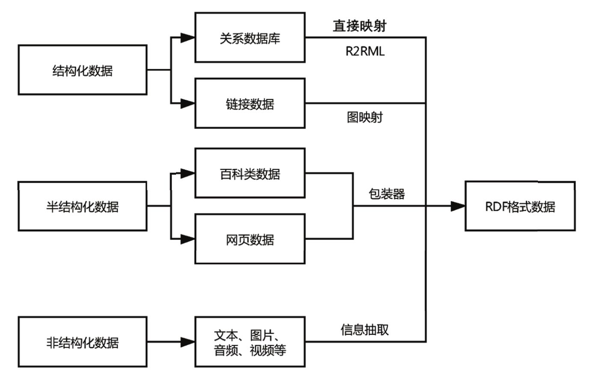
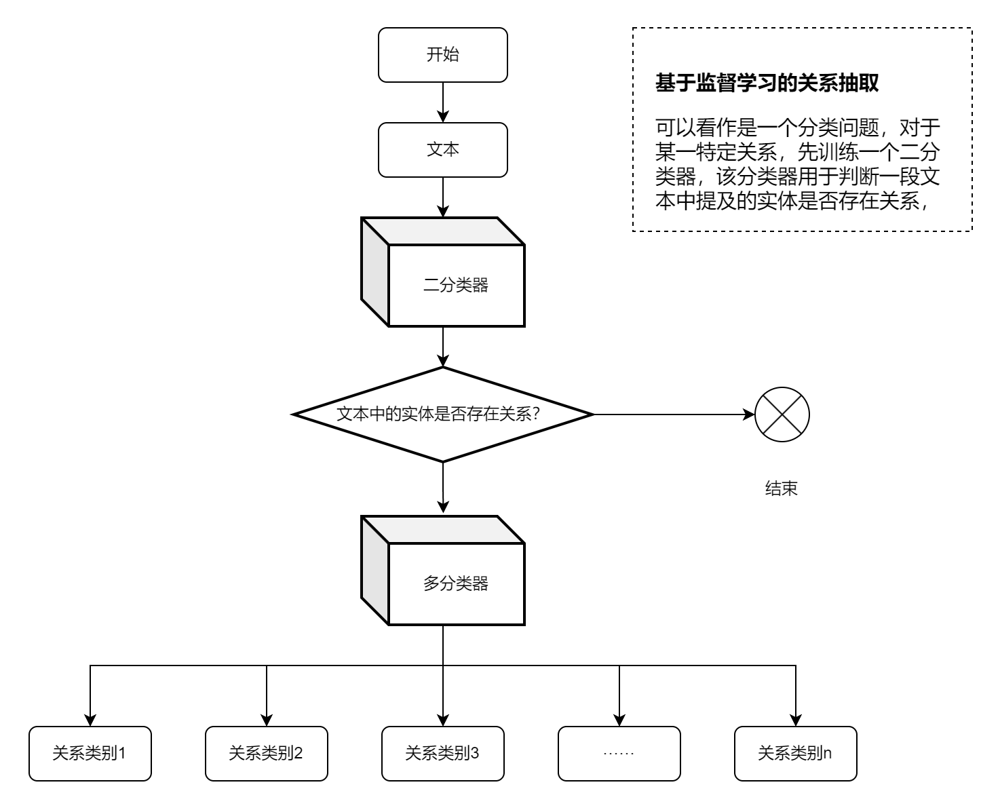
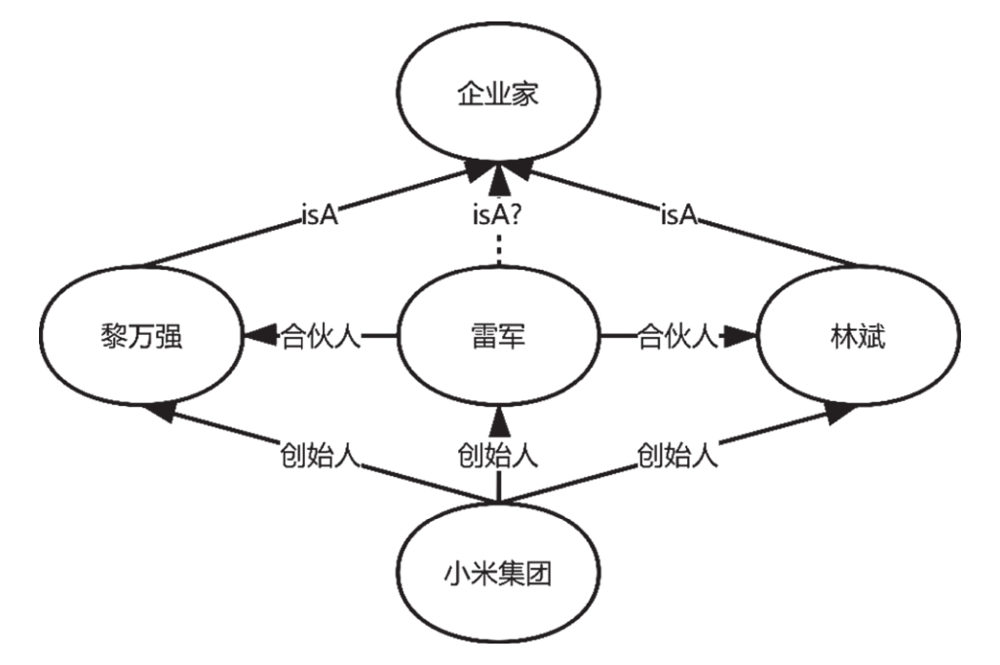
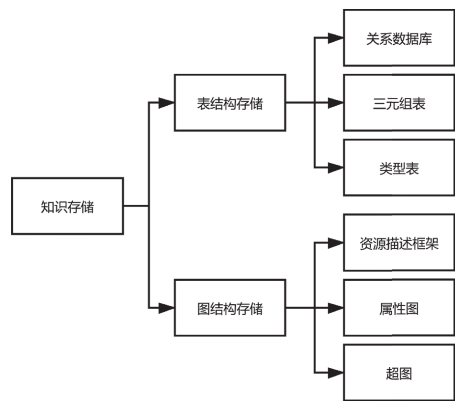
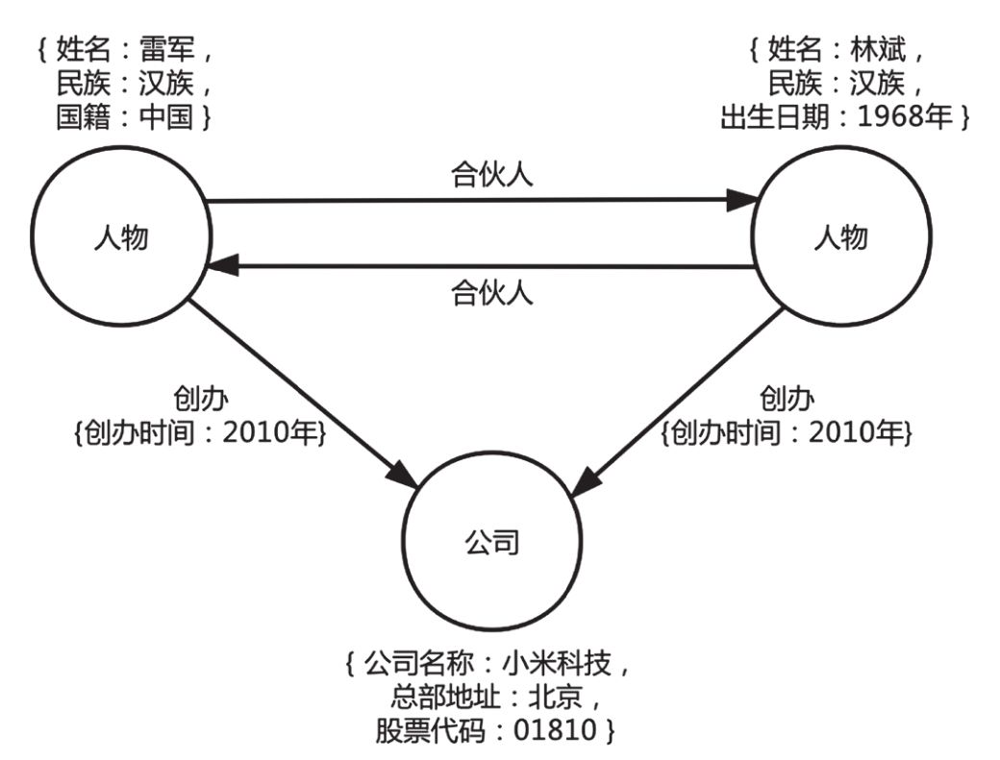
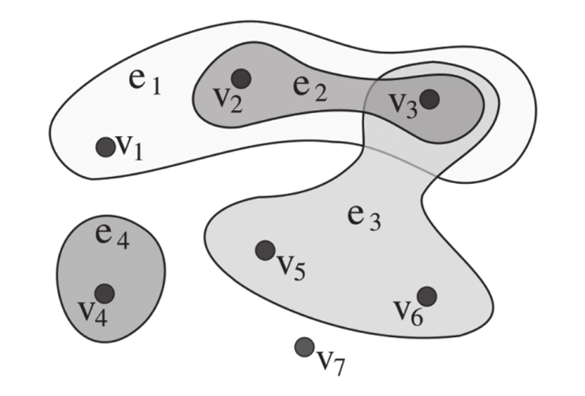
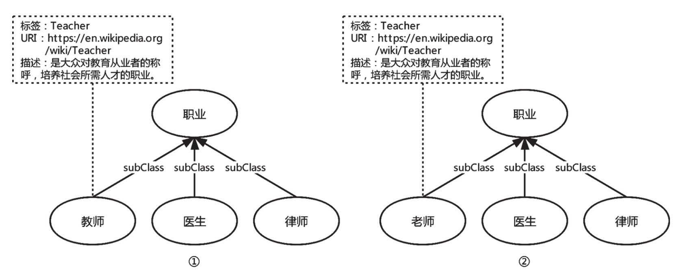
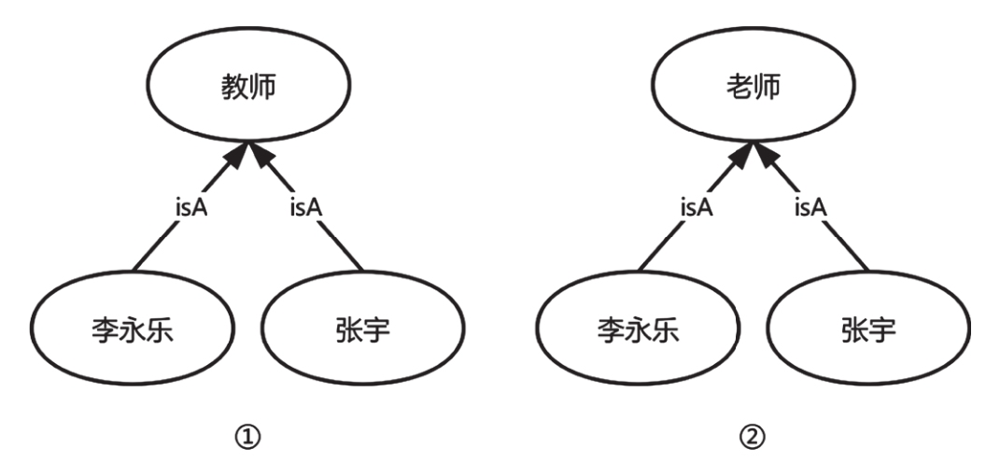
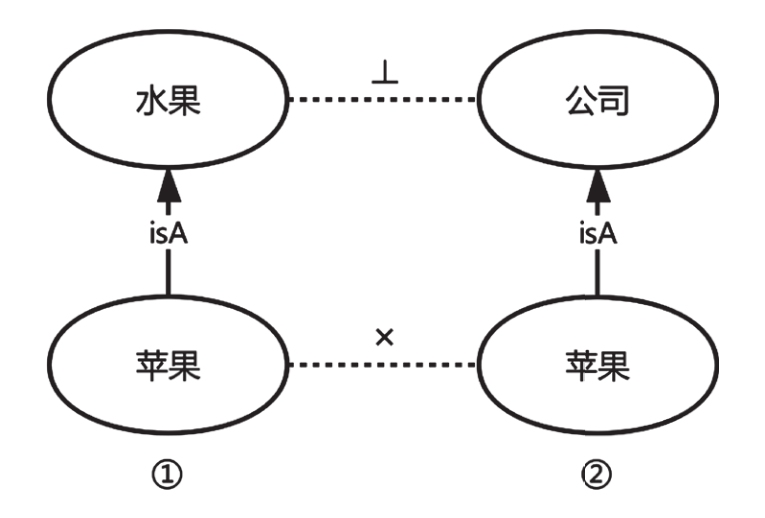

# 知识图谱定义

> 知识图谱，是结构化的语义知识库，用于以符号形式描述物理世界中的概念及其相互关系，其基本组成单位是“实体–关系–实体”三元组，以及实体及其相关属性–值对，实体之间通过关系相互联结，构成网状的知识结构。
>
> <p align=right>——刘峤教授.电子科技大学</p>


# 资源描述框架RDF

（Resource Description Framework，RDF），它把知识表示为一个包含主语（Subject）、谓语（Predicate）和宾语（Object）的三元组<S,P,O>

XML示例：

```xml
<?xml version="1.0 "?>
	<rdf:RDF xmlns:rdf= "http://www.w3.org/1999/02/22−rdf−syntax−ns#"
	xmlns:ab= "http://www.about.com/" 
	xml:base= "http://www.base.com/">
		<rdf:Description rdf:ID= "Lei Jun"
   		ab:work= "CEO"
   		ab:age= "40">
   			<ab:friend rdf:nodeID= "s3fo" />
   		</rdf:Description>
        
   		<rdf:Description rdf:nodeID= "s3fo"
   			rdf:ID= "Lin Bin"
   			ab:age= "40">
   		</rdf:Description>
	</rdf:RDF>
```

其中xml:base是基链接，


# 知识图谱的技术体系

## 知识表示与知识建模

### 知识表示

将现实世界中知识用计算机可理解的一种抽象替代。


知识表示的方法和形式化语言有很多种，不同的表示方法会带来不同的表示效果。这就使得我们需要一种公认的描述方法来对需要表示的知识进行描述，这种方法必须足够简洁并且具有较强的可扩展性以适应现实世界知识的多样性，这就引出了接下来将会介绍的描述逻辑与描述语言。

#### 1. 描述逻辑

描述断言，例如<小米公司，法定代表人，雷军>，用运算符表示：雷军 = 小米公司 ∧ 董事长


#### 2. 描述语言

用XML描述


### 知识建模

建模过程：

#### 1. 知识获取

      1. 自动获取：从Web获取数据
      2. 手动输入


#### 2. 知识结构化


## 知识抽取与知识挖掘

### 知识抽取



其中 非结构化数据 抽取钟，文本信息抽取主要由三个子任务构成，分别是实体抽取、关系抽取和事件抽取。


#### 实体抽取

<p align=right>——可以看作一种序列标注问题，使用特定的标注规范，对文本中的每个字标注序列标签。</p>

抽取文本中的原子信息，形成实体结点

① 基于规则和词典的抽取方法

<p align=right>——采取字符串匹配的方式抽取实体,匹配规则有基于正向最大匹配方法和基于逆向最大匹配方法等</p>

② 基于统计学习的抽取方法

<p align=right>——可选择<a href="读书笔记-从零构建知识图谱.assets/隐马尔可夫模型.md">隐马尔可夫模型</a>、条件随机场模型等</p>

③ 混合抽取方法，目前实体抽取的主流方法是将机器学习模型与深度学习相结合，如[LSTM-CRF](读书笔记-从零构建知识图谱.assets/BILSTM-CRF模型.md)模型


#### 关系抽取

① 基于规则的抽取方法

1. 基于触发词的关系抽取方法——将谓语作为触发词定义好，例如基于触发词的模板：X创始人Y。触发词是“创始人”，
2. 基于依存句法分析的关系抽取方法

② 监督学习方法



③半监督学习方法

- 基于种子数据的启发式算法
  - 预先准备一批高质量的三元组结构数据作为种子；
  - 以这批种子数据为基础，去匹配语料库中的文本数据；
  - 找出提及实体对和关系的候选文本集合；
  - 对候选文本进行语义分析，找出一些支持关系成立的强特征，并通过这些强特征去语料库中发现更多的实例，加入种子数据中，再通过新发现的实例挖掘新的特征；
  - 重复上述步骤，直至满足预先设定的阈值。

- 远程监督学习方法
  - 该方法利用已有的知识库对未知的数据进行标注，
  - 通过人工构建先验知识缩小数据集范围；
  - 也可以引入注意力机制对候选文本赋予不同权重；
  - 最后从候选文本中抽取特征，训练关系抽取的分类器；
  - 并与监督学习结合进行关系抽取。

#### 事件抽取

指的是从自然语言中抽取出用户感兴趣的事件信息，并以结构化的形式存储。

事件通常包含时间、地点、参与角色等属性信息，事件可能因为一个或者多个动作的产生或者系统状态的改变而发生，不同的动作或者状态的改变属于不同的事件，如“马云担任阿里巴巴董事局主席”和“马云卸任阿里巴巴董事局主席”就属于两个事件。

① 元事件抽取

- 模式匹配
- 基于机器学习的元事件抽取


② 主题事件抽取

- 基于事件框架的主题事件抽取
- 基于本体的主题事件抽取


### 知识挖掘

知识挖掘是指从文本或者知识库中挖掘新的实体或实体关系，并与已有的知识相关联的过程。

知识挖掘分为两部分：

1. 实体链接与消歧

   - 如“2019年7月22日，《财富》杂志发布2019世界500强企业排行榜。小米首次登榜，排名468位。”中实体指称“财富”可能对应知识库中多个同名实体，正确的链接是世界著名财经杂志《财富》，而非美国1999年拍摄的电影《财富》以及其他实体；同样，实体指称“小米”需要链接到知识库中的“北京小米科技有限责任公司”，而非人们日常食用的粮食小米等其他实体上。
   - 流程步骤：
     1. 实体指称识别
     2. 候选实体生成
     3. 候选实体排序

   

   

2. 知识的规则挖掘

- 基于关联规则的挖掘

  - 支持度（Support）
    - X→Y的支持度表示集合X与集合Y中的项同时出现的个数与总个数的比值
  - 置信度（Confidence）
    - X→Y的置信度表示集合X与集合Y中的项同时出现的个数与集合X个数的比值

  
  $$
  Support = \frac{X\cap Y}{X+Y}
  \\
  Confidence = \frac{X\cap Y}{X}
  $$
  当规则的支持度和置信度均满足阈值，就可以认定该规则为强相关规则。


- 基于统计关系学习的挖掘

  以图2-9为例，假设图谱中已知结点“黎万强”和“企业家”之间存在isA的关系，

  同时还知道结点“林斌”和“企业家”之间也存在isA的关系，需要预测结点“雷军”和“企业家”之间是否存在isA关系。

  通过图谱可以知道“雷军”和“黎万强”，“雷军”和“林斌”是合伙人的关系，结点“雷军”通过“黎万强”和“林斌”可以到达结点“企业家”，

  通过赋予各条可达边关系的不同权重值，加权求出预测关系的置信度，当预测的置信度超过设定阈值时，可以推断出结点“雷军”和“企业家”之间存在isA关系。

  


## 知识存储与知识融合

#### 知识存储



1. 基于表结构的知识存储

   略

2. 基于图结构的知识存储

   （1）图数据库的分类

   ​		即利用图数据库对知识图谱中的数据进行存储。图数据库是一种可视化的NoSQL数据库，支持数据的增加、删除、查询、修改等操作。优点是可以简单快速检索难以建模的包含复杂层次结构的数据。

   图数据库分为三种，具体介绍如下：

   - [资源描述框架](# 资源描述框架RDF)

   - 属性图

     - 一种**有向图**模型。

       

     - 其中“人物”和“公司”分别为结点的标签，如左上角的人物结点表示雷军，包含姓名、民族、国籍等属性，公司结点表示小米科技，包含公司名称、总部地址、股票代码等属性，雷军创办小米科技，因此关系“创办”由“雷军”指向“小米科技”，同时关系包含属性“创办时间”。

   - 超图

     

     

     ​	超图是一种广义上的图（PS: 离散数学里面的“图”），它的一条边可以连接任意数量的结点，超图的边称为超边，连接的结点用集合表示。

     

        （2）常用的图数据库介绍

     ​			①Neo4j

     

     ​			②OrientDB 

     

     ​			③HyperGraphDB

     ​			


#### 知识融合

> 知识融合，是通过高层次的知识组织，使来自不同知识源的知识在同一框架规范下进行异构数据整合、消歧、加工、推理验证、更新等步骤，达到数据、信息、方法、经验以及人的思想的融合，形成高质量的知识库。

吧吧一堆，说白了就是把一些异构数据、跟知识数据库类型不同的数据变成自己知识库里的数据。在大数据里面就称作[数据清洗](./读书笔记-从零构建知识图谱.assets/数据清洗以及常用的方法.md)。


1. 概念层知识融合

（1）基于文本的方法

​			比较文本的相似度

​			

（2）基于结构的方法

​		像上图一样，教师和老师都属于职业且相同兄弟结点：医生、律师


（3）基于实例的方法

​		基于实例的方法通过比较两个本体相同实例数量来计算本体之间的相似度，相似度越高，本体之间就越匹配。

​		即看“教师”和“老师”的相同实例结点数量。

​		

​	（4）基于背景知识的方法

​			参考外部资源包括通用词典、专业术语表、搜索引擎、维基百科等。

​	（5）基于逻辑推理的方法

​			通过对本体网络的语义知识进行逻辑推理可以发现未匹配的本体，也可以对初步匹配的本体做逻辑上的推断，剔除不一致的匹配项，提高匹配的准确性。

​			下图中，虽然“苹果①”和“苹果②”两个本体实例通过实例匹配的方法匹配上了，但本体①中的概念“水果”和本体②中的概念“公司”不相交，因此可以认为本体①和本体②不匹配。

​		


2. 数据层知识融合

（1）实体对齐

​	即将不同实体是否是同一对象，如百度百科中的“北京小米科技有限责任公司”和中文维基百科的“小米集团”描述的是同一个对象。

​	可以利用赋予属性不同权重，基于属性相似度打分判断

​	也可以看作是一个二分类问题，使用机器学习解决；

​	基于相似性传播的集体实体对齐方法：假设是同一个实体，迭代匹配，直到收敛或达到设定阈值后停止。

​	基于概率模型的集体实体对齐方法：使用模型如文档主题生成模型、CRF模型等


（2）数据融合工具介绍

​	① Falcon-AO 

​	② XLORE 

​	③Dedupe


## 知识检索与知识推理


### 知识检索

1. 基于查询语言的知识检索

   （1）SPARQL

   ​	是一种用于查询[RDF](#资源描述框架RDF)中信息的查询语言，其主要功能为访问、查询和修改由RDF存储的图数据。

   （2）Cypher

   ​	Cypher是由Neo4j在2011年开发的一种声明式数据库查询语言，其允许对关系数据库进行表示、查询和更新。

 2. 语义搜索

    常用的语义搜索方法主要包括

    - 关键词查询
    - 自然语言查询


### 知识推理

从概念上讲，推理是从已有的知识当中推断出尚未拥有的知识的过程。在知识图谱的表示学习领域最经典的算法即TransE。


# 知识图谱工具

## 知识建模工具

介绍目前最主流的知识建模工具Protégé


## 知识抽取工具

介绍目前主流的[DeepDive](./读书笔记-从零构建知识图谱.assets/DeepDive.md)是由斯坦福大学研发的一个从非结构化数据中抽取实体和关系，得到结构化数据的知识抽取系统。


## 知识存储工具

[Neo4j](./读书笔记-从零构建知识图谱.assets/neo4j教程.md)图数据库


# 从零构建通用知识图谱

先抽取知识，再存储。没看懂...


# 领域知识图谱

## 1. 领域模式构建

   - 采用自顶向下的策略构建模式，比如医药领域知识图谱，有分子、人物、公司、知识产权、适应症等实体类。
   - 还有类似公司和人物之间的关联关系，人物隶属于某个公司，或者人物和公司合作研制分子等等的关系

## 2. 领域知识抽取


- 领域内实体的抽取

  采用LSTM+CRF模型是现今主流做法

- 领域内关系的抽取

  主要的抽取方法有基于规则的关系抽取、监督学习和半监督学习的抽取方法等。

- 领域内属性的抽取

## 3. 领域图谱构建

本节将在已获取实体和关系的抽取结果的基础上，基于这些结构化数据，实际构建图谱。

如果是CSV文件，导入neo4j图数据库只需一句命令，[neo4j教程](./读书笔记-从零构建知识图谱.assets/neo4j教程.md)有详细说明在此不详细展开。


# 知识图谱应用


## 知识可视化

本节主要介绍以[D3](https://blog.csdn.net/qq_45833617/article/details/119699748)为代表的无直接连接的可视化工具，以[ECharts](https://blog.csdn.net/david_520042/article/details/124336484)为代表的第三方知识可视化工具。


## 实体链接

### 定义

将文本当中的命名实体与其在知识图谱中对应的实体进行映射的过程就叫作实体链接。

​	举例来说，“李白这首歌唱的是唐代诗人李白吗？”这句话包含两个名为“李白”的指称，它们所指代的实体并不相同。

​	在阅读这句话时，读者自然地就可以区分出句子中第一个“李白”指的是一首流行歌曲，第二个“李白”指的是唐代的著名诗人李白。

​	这样的区分即一个将句子中的命名实体与记忆中的知识进行链接的过程。


### 难点

- 自然语言中有歧义，如华师是指华东师范大学，华中师范大学还是华南师范大学呢；
- 在知识图谱中存储的实体可能会有不同的称呼，如例如“华南师范大学大学”通常被称为“华师”；
- 知识图谱中存储的同名实体之间相似度较高，例如“绝句”这个名称可以对应多首古代诗歌，这些诗歌之间相似度较高。


### 步骤

1. 任务详细定义

   给定包含若干实体的知识库以及包含若干文本的文本集合，文本中已经标记出可能与知识库中的实体进行链接的指称，实体链接任务即将文本中的每个指称与知识库中的对应实体进行映射。

   当然，在文本中标出的指称中，也存在可能与知识库中的任何实体都无法匹配的指称，此时同样需要实体链接系统正确判断这种情况并给出无法链接的结果。

   在自然语言处理领域中，实体链接任务也常被称为**命名实体消歧**。

   

2. 候选实体生成

   在候选实体生成任务中，将文本中提及的实体指称与知识库中对应的实体名称进行字符匹配，是完成这项任务的主要方法。

   

3. 候选实体排序

   完成候选实体生成任务后，可以获得一个候选实体集合，通常这个集合会包含不止一个实体。

   因此，在生成了候选实体后需要通过不同维度的特征对其进行排序，以确定在候选实体中最终可以与文本指称正确链接上的实体。

   可使用监督排序方法或非监督排序方法。

   

4. 无链接指称预测

   对无法链接的指称进行判断或预测。