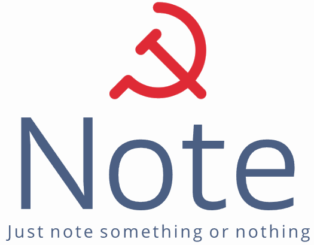

<h1 align="center">
	
</h1>
<p align="center">
    <a href="http://192.168.66.226:8090">
        
    </a>
    <a href="https://github.com/jjellya/Note">
        
    </a>                                                                                       
</p>


Note Just note something or nothing


# Highlighted Features

- None

# Getting Started

To get started with **Note**, follow these steps:

```python
nohup python run.py > output.log 2>&1 &
```


# Contribution Guidelines

We welcome contributions! To contribute to scholar influence prediction, please review our [Contribution Guidelines](./Conribution Guidelines.md) for details on how to submit your changes.

# Community

Join our community on this page to connect with other members, ask questions, and share your insights.

# Acknowledgement

The jelly tools project has received support from the following organizations:

* None


# Plan

> 06-12~06-16

- [x] fb 判断1
- [x] fb 判断2
- [ ] fb 判断3
- [ ] fb 判断4
- [ ] fb 判断5
- [ ] 判断90题
- [ ] 资料30题
- [ ] 言语30题
- [ ] 常识15题
- [ ] 数量15题
- [ ] 申论小作文
- [ ] 申论大作文

