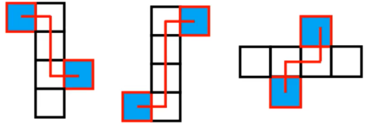
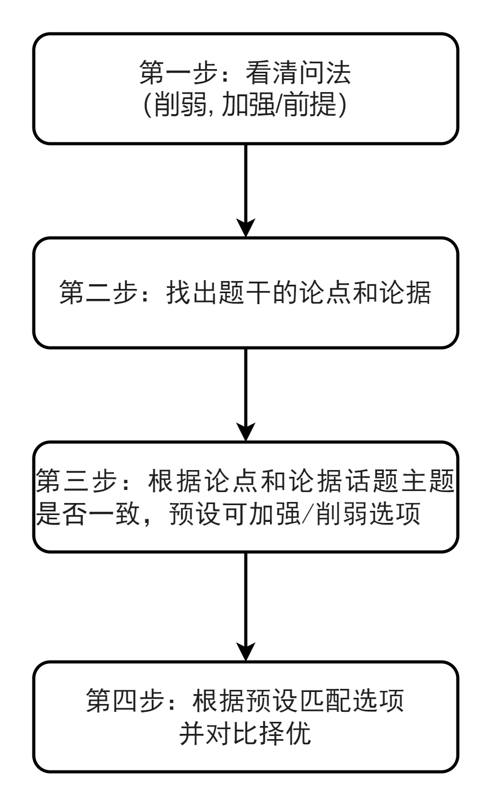

# 1 图形推理

## 1.1 位置规律

图形特征：==元素组成相同==（大部分相同，很小一部分不同，考虑是重合了）

考点：

1. 平移
   1. 方向：直线(上下、左右、斜对角线)、绕圈(顺时针、逆时针)
   2. 步数：恒定、递增(等差)
2. 翻转、旋转
   - 方向：顺、逆时针
   - 常见角度：30°、45°、60°、90°、180°
   - 翻转先看左右，再看上下
     - 左右翻转就是镜像
     - 上下翻转是上下变，左右不变
     - 180°旋转：上下左右都变

### 宫格类题目

==看中间，判方向==

1. 绕圈走：中间黑块数量相同，优先考虑==内外圈==分开看
   - 看间隔，有些速度不一致，间隔会越来越大或越来越小
2. 走直线：中间黑块数量不同，优先考虑上下左右
   - 横行黑块数量相同→左右走
   - 竖行黑块数量相同→上下走

移动路径：

- 循环走

- 反弹走

### 传送门

有时候不看图像，看位置，某个位置就是一栋==传送门==，该==传送门==的图案固定传送到某一个位置

### 回合制

有某一行或某一列移动一==回合==或有一个==回合==保持不动，移动的时候可能左右上下都一起移动，就是所谓的斜着走

## 1.2 样式规律

特征：==元素组成相似==

### 1.2.1 加减同异

特征：==相同线条重复出现==

1. 相加、相减(考的概率低)
2. 求同（保留相同，但这个考的概率也低）
   - 
3. 求异（保留不同）
   - 减掉大家都有的线条

==Attention==

如果选项中有一模一样的图像但只是旋转过的而已，就证明这道题很可能就是要结合位置来思考

### 1.2.2 黑白运算

1. 特征：图形轮廓和分割区域相同，内部的颜色不同
2. 方法：相同位置运算

**其实就是列黑白等式，例如：黑+黑=白 等之类的。**

一般都是横着去看

==区分：==

黑块数量==相同==：优先平移

黑块数量==不同==：优先黑白运算

## 1.3 属性规律

特征：==元素组成不相同、不相似==

考点：

### 1.3.1 对称性

1. 区分对称类型；
2. 对称轴的==数量==和==方向==
   - 可能的考点：对称轴画出来然后做加法 ==等边三角形是题目特征==
   - 可能的考点：对称轴画出来然后观察旋转方向的规律：逆时针、顺时针，还得看看==对称轴跟图形的线==有没有重合
3. 对称轴与图形==线、点、面== 的关系
   - 对称轴经过的地方
4. 两个图形 挨着 或 内外分开，分开看对称 

- 轴对称：“等腰”元素出现
- 中心对称：围绕中心旋转不变的图形
- 轴对称+中心对称：存在相互垂直的对称轴

### 1.3.2 曲直性

1. 特征：出现明显的圆、弧等全曲线图

- 全直线
- 全曲线
- 曲+直

### 1.3.3 开闭性

1. 特征：出现==生活化==或==粗线条==图形，考虑开闭性

-  全封闭
- 全开放
- 半开半闭

## 1.4 数量规律

特征：

1. ==元素组成不同，且属性没规律==
2. 数量特征图明显

考点

==**面**、线、点、素==

### 1.4.1 面数量

什么是面-> 白色封闭区域

==什么时候数面==：

1. 图形被分割，封闭面明显
2. 生活化图形、粗线条图形

  ==面的细化考法==

1. 所有面的形状（三角形、四边形）
2. 相同面的数量（双胞胎、多胞胎）
3. 最大/最小面的形状、属性（对称、曲直）、与外框的关系（相似、  相等）

### 1.4.2 线数量

==什么时候数线？==如果曲线和直线相交就不算单一的直线，即==分离的孤岛==才属于是

- ==直线特征图==：多边形、单一直线
- ==曲线特征图==：曲线图形（圆、弧、单一曲线）

- 数曲线数量
- 数直线：分开看，数黑色的图形的边的数量，数白色图形的边的数量，比较黑白图形的边数，==边数之差==关系可能考==等差数列==

- 笔画数
  - 怎么判断一笔画？
    1. 线条之间连通
    2. ==[奇点](##奇点)==数量为0或2  ==Attention: 奇点只能有偶数个，不要忘记还有端点即只有一条路的那个点==，

### 1.4.3 点数量

什么是点？ => 线与线的交点，切点也属于交点

==什么时候数点？==

1. 线条交叉明显（俗称“大树杈”）
2. 多边形或圆中叉出一些线条
3. 圆相切或圆相交较多

细化考法：		**大部分图都有==圆==或==椭圆==**，可优先考虑点的细化

1. ==切点==：相切图形多，切点明显
2. ==框上/框内交点==：所有图形都有外框，且内部线条与外框存在相交的情况

### 1.4.4 素数量

什么是素？  = > 独立小图形

==什么时候数素？== 

1. 优先考虑元素种类和个数
2. 找相同元素，（某个小图形相同的就行）

素的特殊考点：==部分数==

1. 什么是部分数？ => 连在一起就是一部分
2. 什么时候考虑部分数？ => 生活化、粗线条图形

## 1.5 空间重构

### 1.5.1 相对面

一组相对面==同时出现==的选项——==排除==

1. 同行或同列相隔一个面

2. Z字形两端==(紧邻Z字中线的面)==

### 1.5.2 相邻面——公共边

如何确定公共边： 

1. 平面图中==构成直角==的两条边是同一条边

2. 一列、行连着4个面，两头的两条边是同一条边

### 1.5.3 相邻面——公共点

如何确定公共点：

相邻三个面的公共点是唯一的

看公共点的射线是否一样，看那个公共点可以怎么走

### 1.5.4 小结

三个面挨在一起—— ==优先公共点==

三个面没有挨在一起—— ==优先公共边==

### 1.5.5 相邻面——画边法

1. 结合选项，找一个特殊面的==唯一点==或==唯一边==
2. 顺/逆时针防线描边标号（描同一个面）
3. 题干与选项对应面不一致——==排除==

# 2 类比推理

## 2.1 语义关系

### 2.1.1 近义词、反义词

1. 常见易错成语要积累
2. 优先看简单、熟悉的
3. 不熟悉通过“字面意思”猜
4. 遇到困难，只看一个词想它的近义或反义

==二级辨析==

考虑感情色彩, 同时也要考虑感情色彩的==顺序==，比如，前贬后褒

### 2.1.2 比喻象征义

## 2.2 逻辑关系

### 2.2.1 全同关系

全等同的关系

### 2.2.2 并列关系

1. 矛盾关系（==非黑即白的==）

   对称：非对称； 雌：雄

2. 反对关系（有第三种关系的，仅仅是互斥的？）

   黑色：白色

### 2.2.3 包容关系

==s注意区分种属和组成，种属包括域界门纲目科属种，组成是一个个单位组成==

1. 种属关系 is a

   苹果：水果

2. 组成关系 contains a

   轮胎：汽车

### 2.2.4 交叉关系

题干特征：从不同角度描述同一类事物。

==判定技巧——造句子==

有的A是B，有的A不是B

有的B是A,  有的B不是A

### 2.2.5 对应关系

1. 原材料和工艺

   工艺二级辨析：物理变化 和 化学变化 

   

2. 功能 ：对外的描述

   常考二级辨析：主要、次要

   

3. 属性：对内的描述

   常考二级辨析：必然、或然
   
   看到
性
字就要考虑是否是==必然==的
   
4. 时间顺序

   一般为动词+动词

   常考二级辨析：主体 能否一致

5. 因果关系

   二级辨析：看是 自然的 还是 人为的

6. 方式目的：为了

   常考二级辨析：方式对错，目的能否达到 

   

## 2.3 语法关系

### 2.3.1 主谓关系

### 2.3.2 动宾关系

### 2.3.3 主宾关系

### 2.3.4 偏正

例：

- 形容词+名词
  - 美丽：花朵
- 副词+动词
  - 跑步：慢慢地
- 名词+名词
  - 历史老师

## 总结

| 一级关系   | 二级辨析                             |
| ---------- | ------------------------------------ |
| 近反义关系 | ==感情色彩==                         |
| 并列关系   | ==顺序==                             |
| 工艺       | ==物理、化学==                       |
| 属性       | ==必然、或然==                       |
| 功能       | ==主要、次要==                       |
| 先后顺序   | ==主体能否一致==                     |
| 因果       | ==原因：人工/自然；结果：积极/消极== |
| 方式目的   | ==方式对错、目的能否达到==           |

​	

# 3 定义判断

给出概念的定义，选出最合适的选项

对比择优，接受不完美

 

## 3.1 主客体

主客体不符合的选项一定不符合定义

不一定都有

出现范围越小越明确的主客体，尤其重要

==主动和被动也很重要==

出现==否定词==的需要重点关注

行政机关：各级政府（国务院……街道办/乡镇政府、公安、各种局等

权力机关：全国人大、地方人大

司法机关：法院、检察院

事业单位：学校、医院、科研所、广播新闻出版社等

社会组织：商会（浙商会）、协会（消费者协会）

## 3.2 长定义

优先看定义所在的句子

## 3.3 拆词

定义词汇本身就是关键词 

# 4 翻译推理

题目特征

1. 
题干和选项
中存在明显的
逻辑关联词

2. 提问方式为：可以推出/ 不能推出

解题思维

1. 先翻译
2. 再推理

## 4.1 前推后

典型关联词：如果……，那么……

等价关联词： 如果，就，都，一定、则

## 4.2 逆否等价

逆否定理，离散数学

​      

## 4.3 后推前

典型关联词： 只有……才……

除非……否则不

……是……的基础/假设/前提/关键/必要/必不可少条件

谁==必不可少==，谁==在箭头后==

不……不……

## 4.4 且和或

==A且B：二者同时成立==

等价关键词：和、既……又……，不仅……而且……、……但是……

==A或B：二者至少一个成立==

等价关键词：或者、或者……或者……、至少一个

==”或“的翻译：否1 → 1==, 或关系喜欢考否1推1

”或“关系为真，否定一项可以得到另一项 

==快速解题技巧——找"首尾"==

==A== → B → C → ==D==

##  4.6 德·摩根定律

-(A 且 B) = -A 或 -B

-(A 或 B) = -A 且 -B

A和B

- 都有： A且B
- 都没有：非A且非B
- 只有一个：要么A要么B（A/B）
- 至少一个：A 或 B
- 至多一个： 非A 或 非B

# 5 组合排列

## 5.1 排除法、代入法

1. 排除法：（选项中的信息完整的话，优先使用排除法）
   - 读一句、排一句
   - 材料题第一题通常都会考排除法
   - 比大小的题目，最值很重要，谁是不是那个最大的或者最小的

==题干信息有对有错：优先代入法==

 

## 5.2 排序题

1. 列表格
2. 找间隔多的

==“可以得出”==的题不能用代入题

## 5.3 最大信息

没有确定信息，或者有太多确定信息的时候使用 最大信息

最大信息就是出现最多的那个词

## 5.4 假设法

当且仅当 -> 充要条件

# 6 论证

##  6.1 削弱论证

论证三要素：

- 论点
- 论据
  - 下定义的不是论据
- 论证

==下定义、提问题、说现象、“但”之前都可略读或不读==，因为一般都是铺垫用的。

### 6.1.1 加强题型：赞同

### 6.1.2 削弱题型：反对

常见提问方式：

如果以下各项为真，最能==质疑/反驳/削弱/反对==上述论断的是？

如果以下各项为真，==(最)不能质疑==上述论断的是？

解题思路：

## 6.2 否定论点

**选项特征**：
与论点表述的意思相反

**文段特征**：

文段只有论点、无论据

文段的论点和论据话题一致

------

举例否定削弱是否生效，要看这个例子能否让这个不成立。

丢佢卤味，讲甘hi多废话。无非就是数学论证问题中的，如果题干的表述是**$\forall$**，而选项中的有一个是**$\exists $**，就能算是举例否定

常见话题：

论点为对策：常考 做法是否可行 / 做法是否有效

==常见混淆选项==

1. 
话题不一致

2. 
主题不一致

3. 
不明确选项，例如：没人知道、正在研究、尚不知晓

## 6.3 拆桥

==论点和论据之间==没有必然联系。

==什么时候考虑拆桥？==

1. 没有否论点的选项
2. 论点与论据话题不一致
3. 提问方式为“削弱论证"

==拆桥方式：==

1. 部分代表不了整体
2. 其他部分不这样

## 6.4 否定论据

==什么时候考虑否定论据？==

1. 题干中有”双方互怼“，经常采用否定论据来削弱
2. 题干有论据 ==且== 在找不到否论点和拆桥。

选项特征
与论据表述的意思相反

## 6.5 因果倒置

论点里面有因果关系，然后选项是将论点因果倒置

## 6.6 他因削弱

承认结果，同一个主体、同时存在、两种及以上可能的原因

若论典是其中一种原因，则可用另一种原因进行削弱

==所谓的干扰因素其实就系控制变量法没有控制好。==

## 6.7 加强论证

### 6.7.1 补充论据

==这个虽然力度弱于搭桥，但考频高==

1. 解释原因：说明论点成立的原因——整体上解释
2. 举例支持：证明论点成立的例子——部分上证明

### 6.7.2 搭桥

==问”前提“，优先考虑搭桥，求同存异==

# Appendix

## 奇点

以一个点为中心，发射出奇数条线

