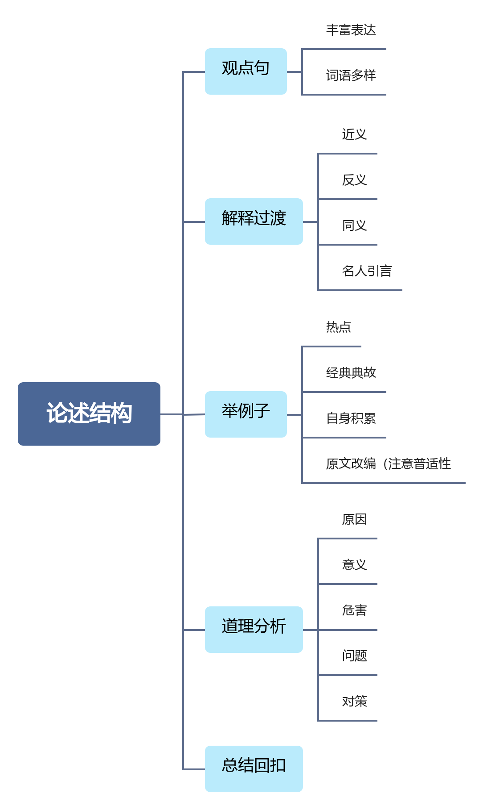

# 单一题

## 影响

## 启示

# 综合题

## 词语解释

【关键词】：含义、定义、理解、内涵

总分总作答。

中间的分，==结合题干或者材料层次逻辑==，来作答。

思路：总——分——总

- 题干有层次答题思路：释义+题干层次1+题干层次2+对策，题干有层次标志：尽管……但……；不仅……也……

- 题干无层次答题思路：释义+材料层次123+对策

  材料层次：按照材料顺序每转换一次话题就出现一个层次

- 题干和材料都没有层次：释义+要素罗列（问题原因等）+对策

## 现象分析题

思路：

表态——论证——总结

- 赞同的：正确的，科学的，合理的、全面的
- 反对的：不正确的，不科学的，不合理的、片面的
- 辩证看待：有积极也有消极的，有利有弊，有待考证，有待观察

# 公文题

## 格式

略

## 正文内容

### 开头

#### 倡议书

背景+目的式

> 
致广大农民朋友切实保护耕地的倡议书

>
> 全市广大农民朋友们：
>
> 　　大家好！耕地是粮食生产的基础，事关广大人民群众温饱，事关国家粮食安全。为进一步提高我市耕地保护工作水平，促进耕地数量、质量、生态“三位一体”保护，助力全面推进乡村振兴，加快农业农村现代化，特向全市广大农民朋友发出如下倡议：
>
> [链接](https://www.sihui.gov.cn/zwgk/xwdt/tzgg/content/post_2852154.html)

> 
S市2024年清明节文明祭扫倡议书

>
> 广大市民朋友：
>
> 　　又是一年春草绿，梨花风起清明时。2024年清明节如期而至，在这个缅怀先辈、祭奠逝者、寄托哀思的时节，为树立文明、节俭祭扫的社会新风尚，大力倡导绿色健康生活方式，推进移风易俗，进一步革除丧葬陋俗、弘扬殡葬新风尚，我们倡议：
>
> [链接](https://www.sihui.gov.cn/zwgk/xwdt/tzgg/content/post_2967875.html)

#### 报告

目的式

> 
 H2024年泳池检测首批报告

>
> ​		为保障广大市民享有卫生健康的水质环境，预防介水传染病的发生，近期，H区卫生监督所联合区疾控中心对辖区内开放的游泳场所分批进行专项监督监测，重点检查各游泳场馆的证件公示、人员健康证、水质净化消毒等情况，并对泳池水的菌落总数、大肠菌群、尿素、游离余氯、浑浊度、pH值等项目进行重点检测。
>
> [链接](https://www.haizhu.gov.cn/hzdt/bmyw/qwsjkj/content/post_9772074.html)

#### 通告

背景：应**什么什么**要求，现将有关事项通告如下：

> 
<b>D省自然资源厅关于开展前航道</b>

> 
<b>自然资源确权登记的通告</b>

>
> ​		根据《自然资源统一确权登记暂行办法》，按照《D省2024年度省级重点河流自然资源确权登记实施方案》要求，D省自然资源厅拟从本通告发布之日起，按照资源公有、物权法定和统一确权登记的原则，开展前航道自然资源确权登记工作。现将有关事项通告如下:
> ​		一、工作时间
>
> ​		自本通告发布之日起六个月以内。
>
> ​		二、工作内容
>
> ​		本次确权登记，重点明确前航道登记范围内自然资源的国家所有权，记载登记范围内各类自然资源的数量、质量、种类、分布等自然状况。本次登记范围涉及G市Y区、H区、L区、T区、P区。
>
> ​		三、其他事项
>
> ​		前航道登记范围涉及的集体土地所有权人、国有土地使用权人等相关主体，应当积极配合做好确权登记相关工作。
>
>   
特此通告。

>
> 
D省自然资源厅

>
> 
2024年5月17日

#### 通知

开头：背景+结果。现将xxx有关事项通知如下。或者 【现将2024年度xxx结果予以公布。】

> 
<b>关于公布2023年度H区民办学校年检结果的通知</b>

>
> 各民办学校：
>
> 　　按照《H区教育局关于开展2023年度H区民办学校年检工作的通知》要求，我局对区属民办学校进行了2023年度办学情况检查。经学校自查自评、普查及复查等相关审核程序，现将2023年度G市H区G大道南小学等22所民办中小学、孙逸仙大学南校区幼儿园等80所民办幼儿园、G市H区青苗教育培训中心等181所校外教育培训机构年度检查结果予以公布。
>
> 　　特此通知。
>
> 　　附件：1.H区民办学校（中小学）2023年度年检结果
>
> 　　2.H区民办学校（幼儿园）2023年度年检结果
>
> 　　3.H区民办学校（校外教育培训机构）2023年度年检结果
>
> 
G市H区教育局

>
> 
2024年7月30日

>
> 
（职业成人幼儿教育科，联系电话：89185340）

#### 公开信

也是==背景+目的==式

> 
<b>致全市广大生产经营单位的公开信</b>

>
> 全市各生产经营单位：
>
> 　　今年4月底，国务院安委会印发了《全国重大事故隐患专项排查整治2023行动总体方案》，要求自今年5月起至12月底，全国各地区、各有关单位和企业聚焦重大事故隐患深入开展排查整治。这次专项行动是贯彻落实党的二十大精神和习近平总书记关于安全生产重要论述重要指示批示精神、有效遏制重特大事故发生的重大举措。我市广大生产经营单位务必把思想和行动统一到国务院、省、Z、S市政府的部署要求，迅速开展重大安全事故隐患排查整治工作。
>
> 　一、要扛起隐患排查整治的主体责任。企业是事故隐患排查整治的责任主体，企业主要负责人是法定的安全生产第一责任人，建立健全并落实本单位全员安全生产岗位责任制、组织排查整改进而消除重大事故隐患是主要负责人的法定义务，企业主要负责人要切实履行第一责任人责任全面带动企业全员安全生产岗位责任落实，切实提高企业隐患排查和整改的质量。
>
> 　　二、立即研究组织本企业重大事故隐患排查整治。企业主要负责人要学习研究本行业领域重大事故隐患判定标准或重点检查事项，集中开展重大隐患自查自改；建立企业重大事故隐患台账清单，实行闭环管理，能立即整改的，要迅速整改；需要一定时间整改的，要明确责任人、措施、资金、期限和应急预案，并按分级属地原则向负有安全监管职责的行业主管部门报告；及时吸取省内外、国内外发生的典型事故教训，迅速组织排查整治本企业同类事故隐患；每季度带队对本单位重大事故隐患排查整治情况至少开展1次检查。
>
> 　　三、落实全员安全生产岗位责任。企业主要负责人要建立健全全员安全生产岗位责任制，明确从主要负责人到一线从业人员（包括劳务派遣人员、实习生等）的安全生产岗位责任，组织制定企业各分管负责人安全生产职责清单和本次专项行动工作清单；按照《安全生产法》等相关法律法规规定，设置企业安全生产管理机构或者配备专兼职安全生产管理人员；强化技术指导，精准查找重大事故隐患、科学治理重大事故隐患，提高隐患排查和整改的质量。
>
> 　　四、组织对动火等危险作业开展排查整治。企业主要负责人要深刻吸取国内近期因违规动火引发的重特大事故教训，组织开展1次全员安全警示教育活动；严格履行动火作业审批手续，严格落实消防安全措施检查和作业过程监督；严禁聘用和招请未经安全培训合格、未取得相关证书的人员在特种作业岗位上岗作业；全面排查本企业涉有限空间、临时用电、高空作业等特殊作业风险点，逐一落实风险辨识警示、培训教育、作业审批和现场监护等安全措施。
>
> 　　五、组织对外包外租等生产经营活动开展排查整治。针对本企业生产经营项目和场所外包外租情况组织开展1次全面排查，重点检查是否存在承包承租方不具备安全生产条件或者相应资质以及双方未签订安全生产协议、安全生产管理职责不清等问题，不符合法律法规规定的要坚决依法处理；将外包外租等生产经营活动纳入本企业安全生产管理体系。
>
> 　　六、组织开展事故应急救援演练活动。企业主要负责人要根据本行业领域事故特点，至少组织开展1次事故应急救援预案演练（非煤矿山、危险化学品、烟花爆竹、交通运输、建筑施工、民用爆炸物品、金属冶炼、渔业生产等高危行业领域企业每半年至少1次）。通过定期演练、安全教育培训等，让全体从业人员主动落实安全生产岗位责任，熟知安全逃生出口（或避灾路线），切实提高从业人员应急避险意识。   
>
> 　　各生产经营单位，安全生产责任重于泰山！让我们齐心协力，遵守安全生产法律法规，认真履行好法定职责，以高水平安全护航高质量发展，为我市人民群众生命财产安全和社会大局稳定作出应有贡献。  
>
> 
S市安全生产委员会办公室

>
> 
2023年5月12日

> 
<b>G市争创全国法治政府建设示范市 奋力打造法治城市标杆——致G市民的一封公开信</b>

>
> 市民朋友们：
>
> 　　广南富庶天下闻，四时风气长如春。G，是一座千年不衰的商业“奇迹”之城。法治政府建设，为这座千年商都带来勃勃生机，赢得声声赞誉。法治政府建设为了人民、依靠人民，关乎经济社会发展，更关乎民生福祉保障。让我们以创建全国法治政府建设示范市为契机，把G建设成为全国最安全稳定、最公平公正、法治环境最好的国际大都市，让法治成为新发展阶段千年商都最鲜明的底色和最核心的竞争力！
>
> 近年来，G市委市政府坚持以习近平新时代中国特色社会主义思想为指导，深入学习贯彻习近平法治思想，推动法治政府建设不断改革创新、奋进突破。我市在中国法治政府评估中稳居前列并两次获全国第一，在法治D省建设考评中连续获得优秀并蝉联全省第一，六次荣获中国法治政府奖或提名奖，获评法治政府建设典范城市、中国营商环境标杆城市、全国“七五”普法中期先进城市，N区获评首批“全国法治政府建设示范区”。这些成绩的取得，离不开广大市民朋友的大力支持和共同努力。　
>
> 　　——善政者，以法为纲，以人为本。我们用心倾听民声，科学谋划法治政府建设蓝图，积极回应社会发展和人民群众的新要求新期待。全国首推党政主要负责人“述法”全覆盖制度，压紧压实“关键少数”法治建设职责。制定全国首部规范立法公众参与的政府规章，践行地方立法“全过程民主”。严格规范行政决策程序，促进科学民主依法决策。在全国“首晒”行政执法数据，让权力在阳光下运行，政府透明度指数在全国49个较大市中排名第一。
>
> 　　——法之必行，在于民心所向。我们用力破解民盼，制定全国首部依法行政条例，为行政权力定规矩、划界限。把“平凡小事”作为“心头大事”，推进电梯安全、井盖管理、老年人优待、学校安全、青年创业等一系列民生立法。在全国率先推出市场轻微违法经营行为免处罚免强制清单，让执法更柔性更有温度。打造“一网通办、全市通办”的“G好办”政务品牌，G市一体化政务服务能力居全国重点城市第二，服务事项覆盖度排名第一。
>
> 　　——法治为民，定分止争。我们用情化解民忧，打造公共法律服务最便捷城市，形成“线上30秒、线下半小时”公共法律服务生态圈。健全多元化纠纷解决机制，成立“G市街坊”群防共治队伍。率先在全国完成市、区两级行政复议体制改革，实现一级政府一个复议机关。不断增强人民群众法治获得感、幸福感、安全感，用法治保障人民安居乐业。
>
> 　　法治政府建设让我们的城市更民主、更公平、更正义、更安全也更便捷。当前，G市正在创建全国法治政府建设示范市，离不开您一如既往的支持、参与、宣传和守护。
>
> 　　征程万里风正劲，重任千钧再出发。让我们携起手来，爱护G市、助力G市、支持G市，打造法治城市标杆，共创幸福美好未来！
>
> 
中共G市委全面依法治市委员会办公室

>
> 
2021年11月15日

# 作文题

==首先你要明确题型，粉笔公考就分为以下四个类型==

==而我根据经验发现，申论的大作文其实就是两种类型==

1. 策论
   - 写对策
   - 什么要用这种对策
   - 这种对策可以解决什么实际问题
   - 长远来看，还可以带来什么好处
2. 骈文
   - 写意义
   - 这个东西什么有意义
   - 正反论证，没有它会有什么坏处，有它会带来什么好处
   - 综上，需要它。

1. 打直球型型：题干指向明确要素——阅卷一般按点给分

   例如：知识的价值

2. 抽象空洞型：题干抽象空洞——阅卷一般侧重解释含义

   例如：不学礼，无以立

3. 逻辑清晰型：题干逻辑清晰——阅卷一般就以题干为分论点

   例如：奖杯属于个人、团队和国家

4. 对立统一型：题干是一对矛盾——阅卷侧重于辩证关系

   例如：试谈有与无

## 拟标题

1. **常规法**

   例:

   把简政放权做实做好

   加强信用体系建设势在必行

2. **比喻式**（不适合用，容易张冠李戴）

   例：

   甘当为民服务的“孺子牛”

   颗粒归仓，筑牢粮食安全“压舱石”

3. 对称式标题

   例：

   讲好中国故事，澎湃时代动能

   守护清朗网络空间，共建美好精神家园

4. 主副式标题

   例：

   试谈“有”与“无”

   ​							——城市建设理念的辩证法

   不患寡而患不均

   ​							——扶贫工作要注重公平

## 文章的开头

1.点题；

2.不斩头 

引用/比喻/排比/对比/描述等+点题

文章开头需要突出文章主题，引出观点。

文章开头大致可以分解为几个部分： 背景铺垫、引出主题，阐释或简要论述主题，引出文章后续观点。

文章开头可以 是一个段落，也可根据实际的情况拆分成两个段落。

## 文章的论证

论证=观点+论据

打组合拳：

观点+（）+（）+（）+（）

1. 直接摘抄——慎用
2. 归纳概括——好用
3. 偷梁换柱——好用
4. 移花接木——好用

方法一：举例论证——用一个典型案例或者多个案例来证明观点。 

【例 1】努力拼搏为实现中国制造提供重要保障，无数科研人员克服万难， 以甘于坐“冷板凳”的精神，高高举起自主知识产权的大旗。正如中国高铁，直 面西方技术掣肘，坚持不懈地攻克材料、工艺、质量等方面的技术难题，成功研 发了可与国际顶尖高铁媲美的“复兴号”。科研人员用坚实的脚步走过千山万水， 用坚毅的信念攻坚克难，创造出一个又一个惊人的成果。正是这些努力提高了中 国科技的含金量，也让中国制造业崛起。 

【例 2】现代文明让文物显得更亲切鲜活，通过现代化的加工，用当代人能 接受、能理解的方式表现、传承，能让文物走近、走进日常生活，让人们感受到 传统文化的博大精深。如今，越来越多的博物馆将文物与现代文化创意产业相结 合：甘肃省博物馆以铜奔马为原型的“马踏飞燕”系列产品，以其“丑萌”风格 被竞相收藏；敦煌研究院的琵琶镜梳礼盒精巧玲珑，将飞天壁画变成了女生随身 携带的好物；河南博物院打造的“考古盲盒”，将文物微缩，变得可随时观摩把 玩„„越来越多的人，通过现代化的商品感受到了文物的魅力

方法二：道理论证——运用讲道理的方法来证明观点。 

【例 1】茶风即作风，干部要有“务实味”，倾听百姓心声，多为百姓办实 事办好事。基层群众所呼唤的，往往不是多么宏大的愿景，而是身边“小事”的 18 切实解决。但反观当下，在某些基层单位中却出现用文件“传达”文件，用会议 “解决”会议的不良之风。长此以往，“办公室”与“街头巷尾”的距离会越来 越远，我党执政根基堪忧。因此，党员干部要多听百姓呼声，多为百姓办实事。 我们既要呼唤多一些做实事的政府官员，又要重视体制机制的作用，建立并完善 各类“市长服务热线”“乡村规章制度”，用为民服务的汗水赢得民众的掌声。 

【例 2】推进社会治理现代化需要向下扎根，汇集群众智慧，也要主动服务， 以群众诉求为导向，提升治理效能。李强总理在记者会上说，“坐在办公室碰到 的都是问题，深入基层看到的全是办法”。要大兴调研之风，从基层吸取民众力 量，汲取民众智慧，让社会治理由政府的“独角戏”，变成人民群众共同参与的 “大合唱”。尊重群众的主体地位，就是让群众不再是被动的管理者、旁观者， 而是主动的治理者，更是服务的接受者、提供者。治理过程群众参与，治理成果 群众共享，才能夯实基层治理基石，也才是推进中国特色社会治理现代的根本所 在、力量之源。

案例：党的好干部 看到泡桐树，就想起焦裕禄；看到木麻黄，就想起谷文昌；看到大亮山，就 想起杨善洲。他们始终把人民放在心中最高位置，以百姓心为心，永远活在人民 心中。

案例：时代青年 北斗卫星团队核心人员平均年龄 36 岁，量子科学团队平均年龄 35 岁，中国 天眼 FAST 研发团队【南仁东带队】平均年龄仅 30 岁……一大批有志青年挑大梁、担重任，生动 展现了新时代中国青年奋发进取的精神风貌。

**案例：中国式创新 创新的形式多种多样：攻克一项新技术是创新，打造一个新产品是创新，解决一个难题也是创新。创新的舞台宽广辽阔：从科研院所到工厂车间，从偏远乡村到改革前沿，处处都是创新的沃土。**

案例：基层治理 只有传承好“枫桥经验”，践行好“浦江经验”，做到二者融合贯通、互为补 充，处理好“多与少”“大与小”“上与下”的关系，才能真正解决好群众关心的 “大事”“小事”。

==关于基层治理，要记住“群众利益无小事，一枝一叶总关情”。==

案例：生态保护 北京野鸭湖，推进生态修复，生物多样性不断改善；江苏淮安白马湖，开展 清理整治，加强生态系统监测；湖北公安崇，退渔还湿，综合治理水环境。

案例：规范但又人性化的执法 行政执法一头连着各级政府，一头连着群众切身利益。每一次执法本身，都 关乎人民群众对党和政府的信任，对我国法治建设的信心。执法要对不同场景、 不同对象选择正确的执法方式。比如在人群聚集围观的情况下,如何坚持依法执 法、文明执法；在面对女性、老人、孩子等特殊群体时,如何做到冷静、理性执 法等等。

# 结尾

“潮平两岸阔，风正一帆悬。站在新时代，我们要用新的治理方式，但是我们也不要忘记xxx，我们 要xxx，要xxx，要xxx，就一定能够在新征程上绘就新蓝图，建 设新功绩”；

也可以使用累累硕果、勃勃生机，如

“潮平两岸阔，风正一帆悬。 赶上了好时代，我们的治理不仅xxx，而且xxx，还能xxx。相信 在xxx，我们的治理会结出累累硕果，中国社会也会焕发勃勃生 机”。